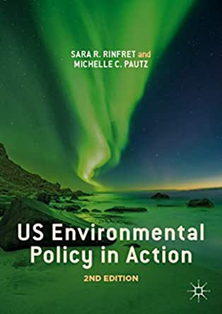
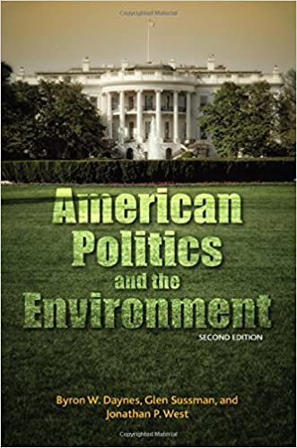

  
```{r setup, include=FALSE}
knitr::opts_chunk$set(warning = FALSE, message = FALSE, 
                      fig.retina = 3, fig.align = "center")
```

```{r xaringanExtra, echo=FALSE}
xaringanExtra::use_webcam()
```

# Syllabus Overview

.pull-left[
<figure>
  
</figure>

]

.pull-right[

**POLI 307: Environmental Policy**

**Spring 2022**

.light[Matthew Nowlin, PhD<br>
Department of Political Science<br>
College of Charleston
]

]

---

class: title title-2

# COVID-19 

.pull-left[
**It's not over** 

**Get vaccinated! (including booster)**

**Masks must be worn _properly_ in class at all times** 

**If you don't feel well, don't come to class**
]

.pull-right[
</br>
<figure>
  
</figure>
]

---

name: outline
class: title title-2

# The Syllabus 

**It's on OAKS (lms.cofc.edu)** 

**Content -> Syllabus** 

**Follow the schedule** 

**But, things likely to change**

**Check OAKS** 

---

class: title title-2

# Your Professor 

.pull-left[
<figure>
  
</figure>
]

.pull-right[
- Dr. Matthew C. Nowlin 

- Email: [nowlinmc@cofc.edu](mailto:nowlinmc@cofc.edu)

- ~~Office~~ Student Hours: Use the [Calendly link](https://calendly.com/nowlinmc/meetings) on the syllabus and on OAKS  

- **Public Policy Concentration** 

- **Environmental Policy Research Group** 
]

---

class: title title-2

# What is this course about? 

**The course will provide an overview of the development of environmental policy issues and environmental politics in the US.** 

--

* Provide a theoretical base for understanding environmental policy change and development; examine the fundamental beliefs and attitudes that have shaped environmental policies; and the major political institutions in the U.S. that conceive, design, implement, and revise environmental policies. 

---

class: title title-2

# What is this course about? 

**The course will provide an overview of the development of environmental policy issues and environmental politics in the US.** 

* Examine environmental policy design including regulation and market-based approaches. 

* Examine several environmental issues including pollution, land management, and energy.  

---

class: title title-2

# Learning Objectives


* Develop an understanding of the evolution of environmental policy and politics in the U.S.

* Develop an understanding of the major policymaking institutions including the Congress, the President, Executive Agencies, the Courts, and their role in environmental policymaking.

* Develop an understanding of the process of policymaking in the U.S. with regard to environmental issues.

* Develop in-depth knowledge about several topics within the broad field of environmental policy.

---

class: title title-2

# Required Materials

.pull-left[
**Readings**

* All required readings will be posted on [OAKS](https://lms.cofc.edu) 

* Read half of the readings for Tuesdays and the other half for Thursdays  

* We will have in-class quiz questions over the readings

]

.pull-right[
**Books**

* Chapters available as pdfs on [OAKS](https://lms.cofc.edu) each week

<figure>
<center>
  
  
</figure>
]

---

class: title title-2

# Other Materials 

.pull-left[
**Access to news**  
* New York Times 
* Washington Post
* POLITICO 
* Post and Courier 
]

.pull-right[
**Devices** 
* Able to access OAKS 
* Able to answer _Poll Everywhere_ questions in class 
]

---

class: title title-2

# Assignments

**Assignments and Points (750 points possible)**

.pull-left[
* Quiz Questions: 200 points total
  * Given in class and worth 5 points each 
]

--

.pull-right[
**Exams**
* Mid-Term Exam: 100 points. Taken on OAKS; **Thurs March 3**  
* Final Exam: 100 points. Taken on OAKS; **NOT comprehensive**; **Mon April 28**

---

class: title title-2

# Assignments

**Policy Brief: 350 points total**

You will pick an environmental problem and complete a series of assignments concerning that issue. Complete instructions on are [OAKS](https://lms.cofc.edu). 

* **Topic Selection: Due Feb 3 (25 points)**
* **Annotated Bibliography: Due Feb 24 (100 points)**
* **Fact Sheet: Due March 31 (100 points)** 
* **Policy Brief: Due April 21 (125 points)** 

---

class: title title-2

# Late Work Policy 

**Really only applies to the policy brief** 

* 48-hour grace period: _can still turn in work with no late penalty_  

--

* After grace period, 10% deduction for each 24 hr period its late 

--

* After 72 hours beyond grace period, assignment will not be accepted 

---

class: title title-2

# Important Information 

**Make note of:** 

* **Honor Code and Academic Integrity** 
* **Students with Disabilities** 
* **Financial Challenges** 
* **Counseling Center** 
* **Center for Student Learning**
* **Religious Holiday Policy** 
* **Weather**

---

class: center, middle

# Quick Overview of Topics 

---

class: title title-2 

# Course Overview 

.pull-left[
* Value Systems and Environmental Policy
* Evolution of Environmental Policy in the United States
* Environmental Policymaking
  * Unofficial Actors
  * Official Actors: Congress
  * Official Actors: The Executive
  * Official Actors: The Courts
]

--

.pull-right[
* Federalism and Environmental Policy Design
* Environmental Regulation
* Market-Based Environmental Policy
* Pollution Control
* Public Lands 
* Energy 
]


---

class: title title-2

# For Next Time 

**Introduction to environmental policy** 

**Readings**:  

* **RP**: Chapter 1, _Environmental Policy in Practice_, pgs. 1-9
* **DSW**: Chapter 1, _The American Political Setting and the Environment_, pgs. 1-9

