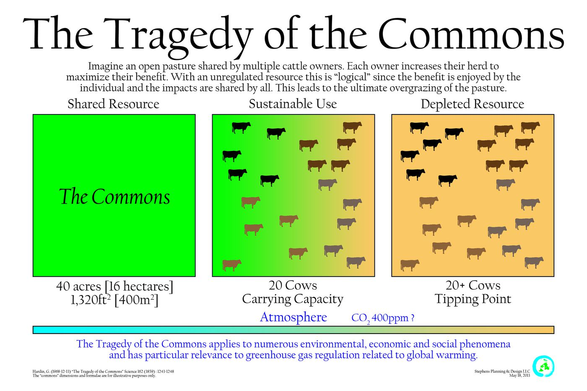

  
```{r setup, include=FALSE}
knitr::opts_chunk$set(warning = FALSE, message = FALSE, 
                      fig.retina = 3, fig.align = "center")
```

```{r xaringanExtra, echo=FALSE}
xaringanExtra::use_webcam()
```

# Course Introduction </br> and Overview

.pull-left[
<figure>
  
</figure>

]

.pull-right[

**POLI 307: Environmental Policy**

**Spring 2022**

.light[Matthew Nowlin, PhD<br>
Department of Political Science<br>
College of Charleston
]

]


---

class: title title-2

# COVID-19 

.pull-left[
**It's not over** 

**Get vaccinated! (including booster)**

**Masks must be worn _properly_ in class at all times** 

**If you don't feel well, don't come to class**
]

.pull-right[
</br>
<figure>
  
</figure>
]

---

name: outline
class: title title-2

# The Syllabus 

**It's on OAKS (lms.cofc.edu)** 

**Content -> Syllabus** 

**Follow the schedule** 

**But, things likely to change**

**Check OAKS** 

---

class: title title-2

# Your Professor 

.pull-left[
<figure>
  
</figure>
]

.pull-right[
- Dr. Matthew C. Nowlin 

- Email: [nowlinmc@cofc.edu](mailto:nowlinmc@cofc.edu)

- ~~Office~~ Student Hours: Use the [Calendly link](https://calendly.com/nowlinmc/meetings) on the syllabus and on OAKS under _Meet with Me_   

]

---

class: title title-2

# Required Materials

.pull-left[
**Readings**

* All required readings will be posted on [OAKS](https://lms.cofc.edu) 

* Read half of the readings for Tuesdays and the other half for Thursdays  

* We will have in-class quiz questions over the readings

]

.pull-right[
**Books**

* Chapters available as pdfs on [OAKS](https://lms.cofc.edu) each week

<figure>
<center>
  
  
</figure>
]

---

class: title title-2

# Other Materials 

.pull-left[
**Access to news**  
* New York Times 
* Washington Post
* POLITICO 
* Post and Courier 
]

.pull-right[
**Devices** 
* Able to access OAKS 
* Able to answer _Poll Everywhere_ questions in class 
]


---

class: center, middle

# Course Introduction

---

class: center, middle

# How _do_ we mangage natural resources in the US?

---

class: center, middle

# How _should_ we mangage natural resources in the US?


---


class: center, middle

# Why are environmental issues controversial? Why don't we agree? 


---

<figure>
<center>
  
</figure>

???
image from national geographic: https://www.nationalgeographic.com/environment/2018/09/news-air-quality-brain-cognitive-function/ 
externatlity 

---

class: title title-2

# Externality

.pull-left[
**Externalities** occur when the total costs and benefits are not captured by the price 
* _Negative externalities_: costs spread from buyers and sellers to society as a whole
]

.pull-right[
<figure>
  
</figure>
]

---

<figure>
<center>
  
</figure>

---

class: title title-2

# Tragedy of the Commons 

</br>

.pull-left[
**A resource open to all may be over consumed** 

* Common-pool goods are _non-excludable_ and _rivalrous_ 

]

.pull-right[
<figure>
  
</figure>
]

---

<figure>
<center>
  
</figure>

---

class: title title-2

# Hypothetical Group Work Question 

* You are assigned to do a group project for a class. Everyone in the group will receive the same grade _regardless of their individual effort_ 

* Does everyone in the group do the same level of work? 

---

class: center, middle

# What do each of the scenarios have in common? 

???
they are collective-action problems 
---

class: title title-2

# Collective Action Problems 

**Situations that arise when the goals of the individual conflict with those of the group**

* Individual _benefits_ vs. Collective _costs_

--

**How do we address collective-action problems**?

* Institutions 

---

class: title title-2

# Institutions

**Institutions are the humanly devised constraints that structure political, economic, and social interaction**

--

**Institutions consist of both informal constraints (sanctions, taboos, customs, traditions, and codes of conduct), and formal rules (constitutions, laws, property rights)** 

--

**Institutions can address some collective action problems, but can cause or exacerbate others**  

---

class: title title-2

# Institutions

**Markets**
* Decentralized collection of buyers and sellers 
* Can arise from _informal constraints_ 

--

**Governments** 
* Produce and enforce _formal rules_ 
* Make _public policy_ 

---

class: title title-2

# Environmental Policy 

**Environmental Policy**: government action related to the natural environment (RP, pg 2)

--

**Environmental Policymaking**: a complex process that involves multiple actors across multiple decision-making venues 

--

**Environmental policy is about making tough choices** 
* Often these choices involve governments assigning (sometimes unintentionally) _costs_ and _benefits_ to individuals, groups, firms, and communities 

---

class: title title-2

# Environmental Dilemmas 

.pull-left[
* Clean or dirty air? 
  * Air pollution has decreased since the 1970s, but what about climate change? 

* Is the water really drinkable? 
  * Nonpoint source water pollution 
]

--

.pull-right[
* Plants and animals 
  * Trade-offs associated with habitat and species protection 

* Waste
  * Who wants a landfill next door? 
]

???
clean air act success a result of scientifically informed regulatory standards 

---

class: title title-2 

# The Political System 

</br>

.pull-left[
**Separate branches sharing power** 

**Authority is diffused across branches and the states** 
]

.pull-right[
**Checks and balances**
<figure>
<center>
  
</figure>
]

---

class: title title-2

# Separation and Sharing of Powers 

</br> 

| Congress | President | Courts 
--- | --- | --- | --- 
**Legislative** | **make laws** | recommend laws, veto, regulations | review laws  
**Executive** | override vetos, oversight | **enforce and implement laws** | review executive acts 
**Judicial** | advise and consent | pardon, nominate judges | **interpret laws** 

---

class: title title-2

# Science 

_To what extent should science be involved in the environmental policymaking process_? (DSW)

--

_How and in what ways do lawmakers respond to scientists who alert them to real and potential environmental problems_? (DSW)

--

**Science is increasingly polarized** 

.pull-left[
<figure>
<center>
  
</figure>
]

.pull-right[
<figure>
  
</figure>
]

???
science and facts vs values
science is a specific way of knowing about the world 

---

class: title title-2

# Values 

**Environmental policy conflicts are often conflicts about _values_** 

--

**Value Divisions** 
.pull-left[
* Preservation and Conservation 
* Environmentalism and Development 
* Materialism and Postmaterialism 
]

--

.pull-right[
* _Cultural Worldviews_ 
* _New Ecological Paradigm_ 
* _Political Beliefs_ (ideology and partisanship)
]

---


class: title title-2 

# Course Overview 

.pull-left[
* Value Systems and Environmental Policy
* Evolution of Environmental Policy in the United States
* Environmental Policymaking
  * Unofficial Actors
  * Official Actors: Congress
  * Official Actors: The Executive
  * Official Actors: The Courts
]

--

.pull-right[
* Federalism and Environmental Policy Design
* Environmental Regulation
* Market-Based Environmental Policy
* Pollution Control
* Public Lands 
* Energy 
]


---

class: title title-2

# Next Week 

**Environmental Values and Value Conflicts** 

* Readings (on [OAKS](https://lms.cofc.edu)) 
  * Nowlin, Chap 4 
  * Kahan et al., article 

**Be ready to try out _Poll Everywhere_**


