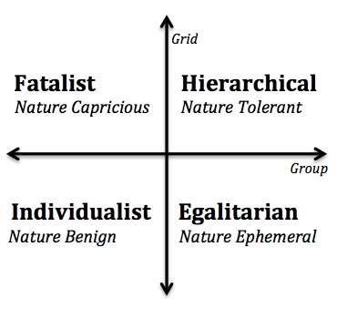
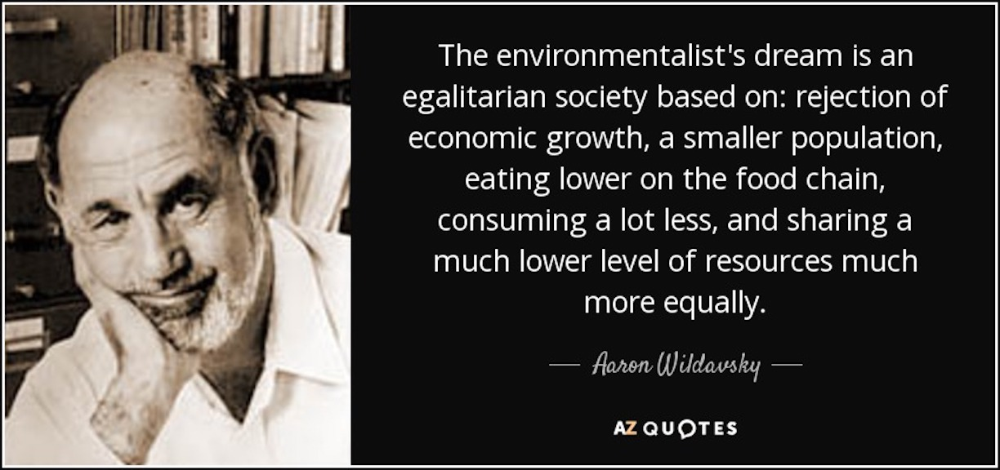
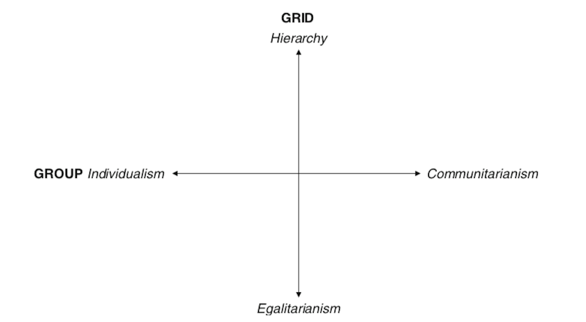
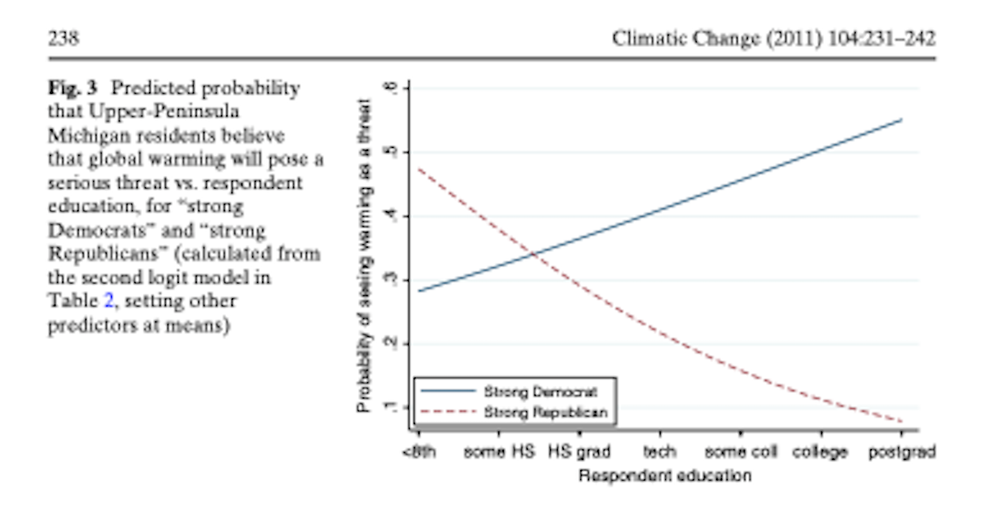

  
```{r setup, include=FALSE}
knitr::opts_chunk$set(warning = FALSE, message = FALSE, 
                      fig.retina = 3, fig.align = "center")
```

```{r xaringanExtra, echo=FALSE}
xaringanExtra::use_webcam()
```

# Value Systems and <br> Environmental Policy

.pull-left[
<figure>
  
</figure>

]

.pull-right[

**POLI 307: Environmental Policy**

**Spring 2022**

.light[Matthew Nowlin, PhD<br>
Department of Political Science<br>
College of Charleston
]

]

---

class: title title-2

# Environmental Policy 

**Environmental Policy**: government action related to the natural environment 

-Rinfret and Pautz, pg 2

--

**Environmental Policymaking**: a complex process that involves multiple actors across multiple decision-making venues 


---

class: center, middle

# Why are environmental policy issues controversial? Why don't we agree? 

---

class: title title-2

# Environmental Issues 

**Why are environmental policy issues controversial? Why don't we agree?** 

* The difficulty of collective action 

--
* Distributional conflicts over _costs_ and _benefits_ 

--
* The structure of the political and policymaking system 

--
* Science 
  * Politicization of science 
  * _Scientific uncertainty_ 

--
* **Values and value disputes** 

---

class: title title-2

# Values 

**Values** determine ideas about what is morally right and wrong, and are typically resistant to change

--

**Values**: 

--
* Abstract concepts and beliefs

--
* Pertain to desirable end states or behaviors

--
* Transcend specific situations

--
* Guide selection or evaluation of behavior and events

--
* Ordered by relative importance

---

class: title title-2

# Value System

<figure>
<center>
  
</figure>

**Value systems are hierarchically structured** 

--

__Core values__: 
* Foundational values that span multiple policy domains 
    * _Political ideology_, _cultural worldviews_ 
    
---

class: title title-2

# Value System

<figure>
<center>
  
</figure>

**Value systems are hierarchically structured** 

--

__Environmental values__:
* The appropriate relationship between humanity and nature
  * _Environmentalism_

---

class: title title-2

# Value System

<figure>
<center>
  
</figure>

**Value systems are hierarchically structured** 

--

__Policy attitudes__:
* Evaluations about particular policy issues
  * _Climate change poses a significant risk_ 


---

class: title title-2

# Core Values: Political Ideology

**Ideas about the role of government in society** 
* Liberal vs. Conservative

--

**Stability vs change** 

--

**Disagreement about the size, scope, and nature of government** 

--
* Size: taxing and spending 

--
* Scope: public vs. private concerns 

--
* Nature: collective decision-making vs. imposed rules 

---

class: title title-2

# Spending on the Environment 

<figure>
<center>
  
</figure>

---

class: title title-2

# Core Values: Political Ideology

**The environment as a political issue has become increasing polarized across ideological beliefs** 

--
* **Solution aversion**
  * If government regulation is the _solution_ then there isn't a _problem_  

--

* **Elite driven**
  * Elected officials 
  * Energy and industry groups 

---

class: title title-2

# Environmental Values 

**Early environmental values: _Preservation_ and _Conservation_**
* __Preservationist__: Preserve and protect nature for its own sake

--
* __Conservation__: Prudent use of natural resources

--

**Contemporary conservation**: contains strands of traditional preservationist and conservation ideas

--

__Deep Ecology__: humans are merely a part of the larger ecosystem, which should be protected without the consideration of harm to humans


---

class: title title-2

# Environmental Values

**Environmentalists vs Development** 

--

**New Ecological Paradigm scale**  


.pull-left[.small[
* The balance of nature is very delicate and easily upset
* Humans live on a planet with very limited room and resources
* Humans are seriously abusing the environment
]
]

--

.pull-right[.small[
* _Humans will eventually learn enough about how nature works to be able to control it_ 
* _The so-called ‘ecological crisis’ facing humankind has been greatly exaggerated_ 
* _The Earth has plenty of natural resources if we just learn how to develop them_
]
]

---

class: title title-2

# Environmental Values

**Environmentalists vs Development** 

--

**Cornucopians** 

.pull-left[.small[
* Emphasis on economic growth and markets 
* Environmental restrictions limit economic well-being
* High confidence in technological solutions
* Individual liberty: 
  * Environmentalists are "watermelons"
]
]


.pull-right[
<figure>
  
</figure>
]

---

class: title title-2

# Why Watermelons?


.pull-left[
</br>
<figure>
  
</figure>
]

--

.pull-right[
<figure>
  
</figure>
]

---

<iframe src="https://embed.polleverywhere.com/multiple_choice_polls/FTRDwrbeELcV2Ysk8J645?controls=none&short_poll=true" width="800px" height="600px"></iframe>

---

class: title title-2

# Cultural Theory 


**Cultural theory is a core value** 

--

**Values based on cultural bias, social relations, and ways of life** 

--

* Cultural bias: _Shared values and beliefs_

--

* Social relations: _Patterns of interpersonal relations_

--

* Ways of life: _Viable combinations of social relations and cultural bias_


---

class: title title-2

# Cultural Theory 

**Ways of life (or cultural types or cultural worldviews) are captured by two cross cutting dimensions; grid and group** 

--

* **Grid**: _Degree that an individual's life is limited by externally imposed prescriptions; social regulation_

--

* **Group**: _Degree that an individual is incorporated into bounded units_ 

--

**Combining the grid and group dimensions produce four viable ways of life, or cultural types**


---

class: title title-2

# Cultural Theory 

</br>

.pull-left[
<figure>
  
</figure>

]

--

.pull-right[.small[
**Hierarchical**: Tight groups with clearly defined roles 

**Egalitarian**: Group commitments and no social stratification

**Individualist**: Free competition among individuals and few group constraints

**Fatalist**: Little or no group attachments, yet choices are constrained by external forces 
]
]

---

class: title title-2

# CT and the Myths of Nature 

<figure>
<center>
  
</figure>

---

class: title title-2

# Aaron Wildavsky


<figure>
<center>
  
</figure>

---

class: title title-2

# Cultural Cognition 

.pull-left[
</br>
<figure>
  
</figure>
]

.pull-right[
**Values and beliefs guide how people _think_ about policy issues** 

Environmental policy debates are not about science as much as they are _about opposing cultural values and worldviews through which that science is seen_ 
]

---

class: center, middle 

# Does increased knowledge reduce the polarization of views about climate change? 

---

<figure>
  
</figure>

---

<figure>
  
</figure>

---

</br>

<figure>
  
</figure>

---

class: center, middle 

# What? Why? How? 

---

class: title title-2

# Mechanisms of Cultural Cognition

--

**Cultural identity-protective cognition** 
* Policy attitudes do not threaten an individual's _identity_ 
* Values are connected to identity 

--

**Culturally biased assimilation of information** 
* Information is processed in a way that confirms values and prior beliefs 
* _The "smarter" you are the better you are at aligning information with your values_ 

---

class: title title-2

# Mechanisms of Cultural Cognition

**Cultural availability** 
* Events or information that matches beliefs more readily come to mind 

--

**Cultural credibility**
* Sources that match beliefs are more credible 

--

**Cultural-identity affirmation** 

