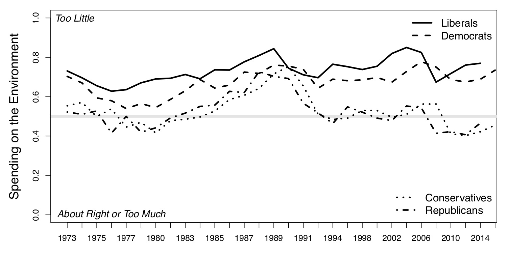

  
```{r setup, include=FALSE}
knitr::opts_chunk$set(warning = FALSE, message = FALSE, 
                      fig.retina = 3, fig.align = "center")
```

```{r xaringanExtra, echo=FALSE}
xaringanExtra::use_webcam()
```

# Value Systems and Environmental Policy

.pull-left[
<figure>
  
</figure>

]

.pull-right[

**POLI 307: Environmental Policy**

**Spring 2021**

.light[Matthew Nowlin, PhD<br>
Department of Political Science<br>
College of Charleston
]

]


---

class: title title-2

# Values 

**Values** determine an individual’s ideas about right and wrong, and are typically resistant to change

--

**Values**: 

--

* Concepts or beliefs

--

* Pertain to desirable end states or behaviors

--

* Transcend specific situations

--

* Guide selection or evaluation of behavior and events

--

* Ordered by relative importance


<!-- * Environmental policy debates are not about science as much as they are _about opposing cultural values and worldviews through which that science is seen_ -->

---

class: title title-2

# Value System

<figure>
<center>
  
</figure>

**Value systems are hierarchically structured** 

--

</br>

__Core values__: 
* Foundational values that span multiple policy domains 
    * _Political ideology_, _cultural worldviews_ 
    
---

class: title title-2

# Value System

<figure>
<center>
  
</figure>

**Value systems are hierarchically structured** 

--

</br>

__Environmental values__:
* The appropriate relationship between humanity and nature
  * _Environmentalism_

---

class: title title-2

# Value System

<figure>
<center>
  
</figure>

**Value systems are hierarchically structured** 

--

</br>

__Policy attitudes__:
* Evaluations about particular policy issues
  * _Climate change poses a significant risk_ 


---

class: title title-2

# Core Values: Political Ideology

**Stability vs change** 

--

**Disagreement about the size, scope, and nature of government** 

--

* Size: taxing and spending 

--

* Scope: public vs. private concerns 

--

* Nature: collective decision-making vs. imposed rules 

--

**The environment as a political issue has become increasing polarized** 

---

class: title title-2

# Spending on the Environment 

<figure>
<center>
  
</figure>

---

class: title title-2

# Environmental Values 

**Early environmental values: _Preservation_ and _Conservation_**
* __Preservationist__: Preserve and protect nature for its own sake
* __Conservation__: Prudent use of natural resources

--

**Contemporary conservation**: contains strands of traditional preservationist and conservation ideas

--

__Deep Ecology__: humans are merely a part of the larger ecosystem, which should be protected without the consideration of harm to humans


---

class: title title-2

# Environmental Values

**Environmentalists vs Development** 

--

**New Ecological Paradigm scale**  


.pull-left[.small[
* The balance of nature is very delicate and easily upset
* Humans live on a planet with very limited room and resources
* Humans are seriously abusing the environment
]
]

--

.pull-right[.small[
* _Humans will eventually learn enough about how nature works to be able to control it_ 
* _The so-called ‘ecological crisis’ facing humankind has been greatly exaggerated_ 
* _The Earth has plenty of natural resources if we just learn how to develop them_
]
]

---

class: title title-2

# Environmental Values

**Environmentalists vs Development** 

--

**Cornucopians** 

.pull-left[.small[
* Emphasis on economic growth and markets 
* Environmental restrictions limit economic well-being
* High confidence in technological solutions
* Individual liberty: 
  * Environmentalists are "watermelons"
]
]


.pull-right[
<figure>
  
</figure>
]

---

class: title title-2

# Why Watermelons?


.pull-left[
</br>
<figure>
  
</figure>
]

--

.pull-right[
<figure>
  
</figure>
]

