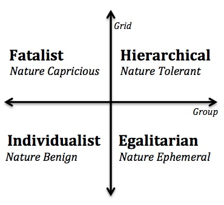
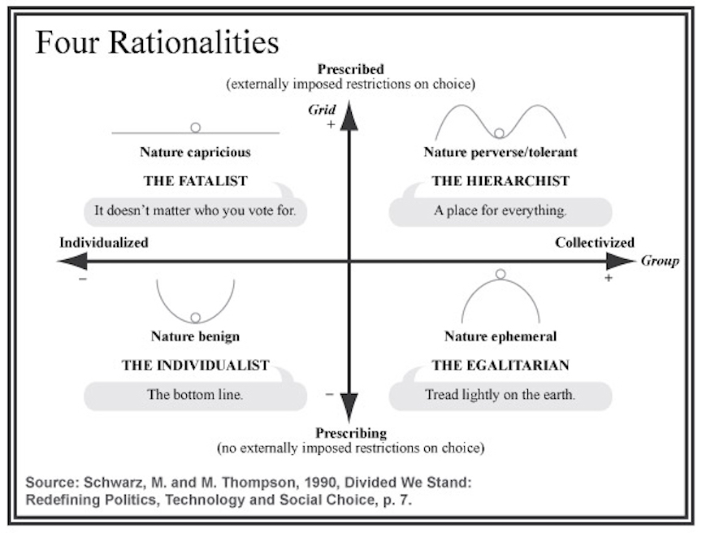
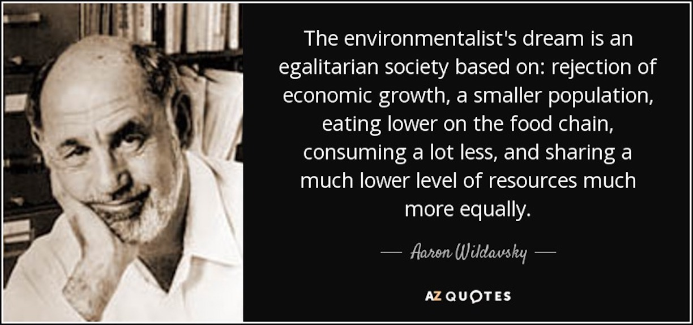
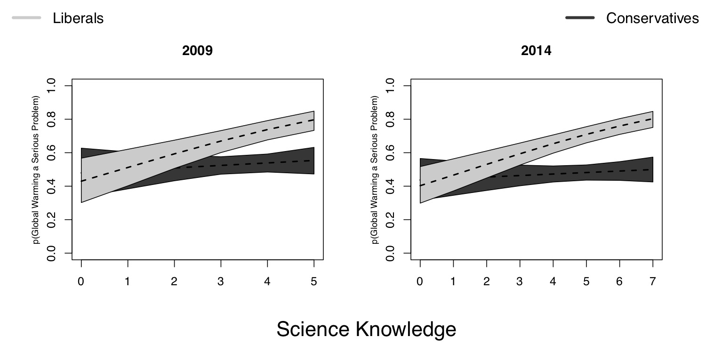
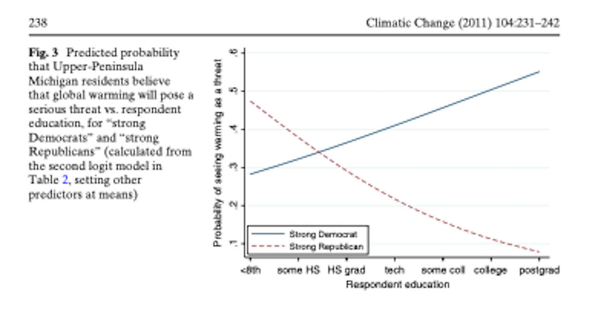
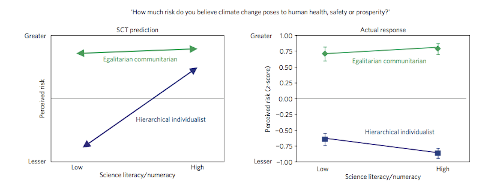

  
```{r setup, include=FALSE}
knitr::opts_chunk$set(warning = FALSE, message = FALSE, 
                      fig.retina = 3, fig.align = "center")
```

```{r xaringanExtra, echo=FALSE}
xaringanExtra::use_webcam()
```

# Cultural Theory and Cultural Cognition

.pull-left[
<figure>
  
</figure>

]

.pull-right[

**POLI 307: Environmental Policy**

**Spring 2021**

.light[Matthew Nowlin, PhD<br>
Department of Political Science<br>
College of Charleston
]

]


---

class: title title-2

# Values System Lecture Review 

* Values system 
  * Core values $\rightarrow$ Environmental values $\rightarrow$ Policy attitudes 

* Ideology as a core value

* Environmental values 
  * Preservation 
  * Conservation
  * Deep Ecology 
  * New Ecological Paradigm scale
  * _Cornucopia_ 
  
---

class: title title-2

# Cultural Theory 


**Cultural theory is a core value** 

--

**Values based on cultural bias, social relations, and ways of life** 

--

* Cultural bias: _Shared values and beliefs_

--

* Social relations: _Patterns of interpersonal relations_

--

* Ways of life: _Viable combinations of social relations and cultural bias_


---

class: title title-2

# Cultural Theory 

**Ways of life (or cultural types or cultural worldviews) are captured by two cross cutting dimensions; grid and group** 

--

* **Grid**: _Degree that an individual's life is limited by externally imposed prescriptions; social regulation_

--

* **Group**: _Degree that an individual is incorporated into bounded units_ 

--

**Combining the grid and group dimensions produce four viable ways of life, or cultural types**


---

class: title title-2

# Cultural Theory 

</br>

.pull-left[
<figure>
  
</figure>

]

--

.pull-right[.small[
**Hierarchical**: Tight groups with clearly defined roles 

**Egalitarian**: Group commitments and no social stratification

**Individualist**: Free competition among individuals and few group constraints

**Fatalist**: Little or no group attachments, yet choices are constrained by external forces 
]
]

---

class: title title-2

# CT and the Myths of Nature 

<figure>
<center>
  
</figure>

---

class: title title-2

# Aaron Wildavsky


<figure>
<center>
  
</figure>

---

class: title title-2

# Cultural Cognition 

.pull-left[
</br>
<figure>
  
</figure>
]

.pull-right[
**Values and beliefs guide how people _think_ about policy issues** 

Environmental policy debates are not about science as much as they are _about opposing cultural values and worldviews through which that science is seen_ 
]

---

class: center, middle 

# Does increased knowledge reduce the polarization of views about climate change? 

---

<figure>
  
</figure>

---

<figure>
  
</figure>

---

</br>

<figure>
  
</figure>

---

class: center, middle 

# What? Why? How? 

---

class: title title-2

# Mechanisms of Cultural Cognition

**How does it work?**

--

* _Cultural identity-protective cognition_ 

--

* _Culturally biased assimilation of information_ 

--

* _Cultural availability_ 

--

* _Cultural credibility_

--

* _Cultural-identity affirmation_ 

--

.small[
**The "smarter" you are the better you are at aligning information with your values** 
]

---

class: title title-2

# Next Week 

**Evolution of Environmental Policy in the United States** 

* Readings (on [OAKS](https://lms.cofc.edu)): 
  * **RP**: Chapter 2, _The Development and Context of American Environmental Policy_
  * Mohai, Paul, David Pellow, and J. Timmons Roberts. 2009. “Environmental Justice.” _Annual Review of Environment and Resources_ 34(1): 405–30 

* Assignments: 
  * Content Quiz 2, **Friday Jan 29**  


