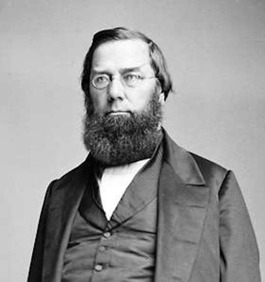
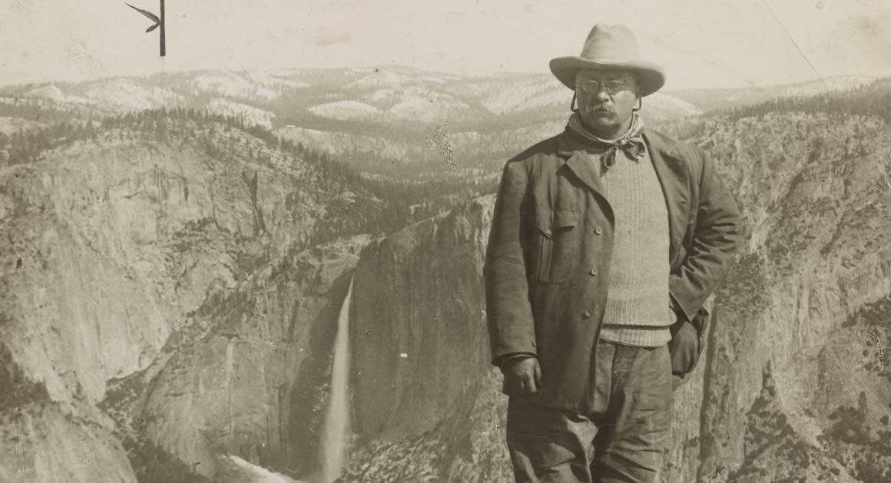
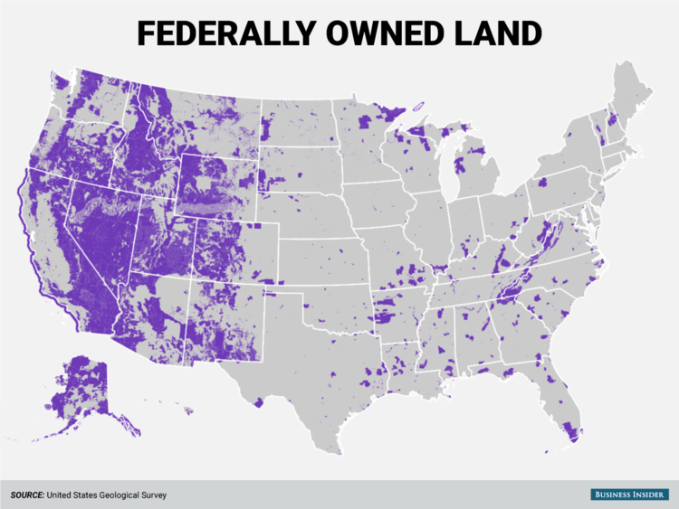

  
```{r setup, include=FALSE}
knitr::opts_chunk$set(warning = FALSE, message = FALSE, 
                      fig.retina = 3, fig.align = "center")
```

```{r xaringanExtra, echo=FALSE}
xaringanExtra::use_webcam()
```

# Evolution of Environmental Policy

.pull-left[
<figure>
  
</figure>

]

.pull-right[

**POLI 307: Environmental Policy**

**Spring 2022**

.light[Matthew Nowlin, PhD<br>
Department of Political Science<br>
College of Charleston
]

]


---

class: title title-2

# Topic Overview 

.pull-left[
**The Green State** 

**Environmental Policy Eras** 
* Development era 
* Conservation era 
* Environmentalism era
* Reform era 
* Stagnation and polarization

**Environmental Justice** 
]

.pull-right[
<figure>
<center>
  
</figure>
]

---

<iframe src="https://embed.polleverywhere.com/multiple_choice_polls/KWTWxq7d0NuywMUwbF3KO?controls=none&short_poll=true" width="800px" height="600px"></iframe>

???
quiz question
---

class: title title-2

# The Green State 

**The subset of the broader administrative state that is organized around institutions, statues, regulations, and court decisions regarding environmental issues** 

--

* Developed over time through a process of _layering_ 

--

* __Path dependent__: previous decisions shape current decision 

--

* Environmental policy decisions involve _trade-offs_ and the distribution of _costs_ and _benefits_ 

---

class: title title-2

# Development Era: 1800-1890

--

* Economic growth and westward expansion

--

* Overlap with the _Industrial Revolution_ (1760-1840)
    * Mechanization and mass production 

--

* __Urbanization__: movement from farms to cities created separation from nature

--

* Little government regulation

---

class: title title-2

# Preservationalist

.pull-left[
</br>
_Man everywhere is a disturbing agent. Wherever he plants his foot, the harmonies of nature are turned to discords_ 

-- George Perkins Marsh, _Man and Nature_ 1864
]

.pull-right[
<figure>
<center>
  
</figure>

]

---

class: title title-2

# Preservationalist

.pull-left[
<figure>
<center>
  
</figure>
]

.pull-right[
</br>
</br>
_In every walk with nature one receives far more than he seeks_

-- John Muir

</br>

\* **But, he was pretty racist** 
]

---

class: title title-2

# Development Era: 1800-1890

**General Survey Act** (1824)
* Authorized the president to have surveys made of routes for transport roads and canals

--

**General Mining Act** (1872)
* Allows mining claims on public property

--

**Yellowstone National Park Protection Act** (1872)
* First national park 

---

class: title title-2

# Conservation Era: 1890-1962

--

**Progressive Era: 1890-1920**
* Stronger role for government 

--

**Conservation**:
* _Limit excesses and encourage both businesses and individuals to use the nation's vast natural resources more carefully through government regulation_ (Kline 2011, 61) 


---

class: title title-2

# Conservation Era: 1890-1962

.pull-left[.small[
_Wise forest protection does not mean the withdrawal of forest resources, whether of wood, water, or grass, from contributing their full share to the welfare of the people, but, on the contrary, gives the assurance of larger and more certain supplies. The fundamental idea of forestry is the perpetuation of forests by use. Forest protection is not an end of itself; it is a means to increase and sustain the resources of our country and the industries which depend on them_
]
]

.pull-right[
</br>
<figure>
<center>
  
</figure>
]

---

class: title title-2

# Conservation

.pull-left[
<figure>
<center>
  
</figure>
]

.pull-right[
</br>
_Conservation means the wise use of the earth and its resources for the lasting good of men_

-- Gifford Pinchot

</br>

\* **But, he was also pretty racist** 

]

---

class: title title-2

# Conservation 

**Three Major Tenets** 

--

* Conservation is not the locking up of resources; it is their development and wise use

--

* Conservation is the greatest good, for the greatest number, for the longest time

--

* The federal pubic lands belong to all the people


---

class: title title-2

# Conservation Era: 1890-1962

* 1902: Bureau of Reclamation: water resource management 
* 1905: Forest Service
* 1908: Grand Canyon national monument
* 1916: National Park Service
* 1933: Tennessee Valley Authority
* 1934: Taylor Grazing Act, _limit overgrazing_
* 1931-1936: Construction of Hoover Dam
* 1940: U.S. Fish and Wildlife Service
* 1946: Bureau of Land Management

---

class: title title-2

# Environmentalism Era: 1962-1980

--

**The Great Broadening** 
* Increase in government and policy in more areas of society 

--

**Ecology**  
* Nature is a system based on interdependence and stability

???
deep ecology: an environmental movement and philosophy which regards human life as just one of many equal components of a global ecosystem.

---

class: title title-2

# Rachel Carson 

.pull-left[.small[
</br>
_I contend, furthermore, that we have allowed these chemicals to be used with little or no advance investigation of their effect on soil, water, wildlife, and man himself. Future generations are unlikely to condone our lack of prudent concern for the integrity of the natural world that supports all life_

-- Rachel Carson, _Silent Spring_, 1962
]
]


.pull-right[
<figure>
<center>
  
</figure>
]

---

<iframe width="560" height="315" src="https://www.youtube.com/embed/ykPH56Udc60" frameborder="0" allow="accelerometer; autoplay; encrypted-media; gyroscope; picture-in-picture" allowfullscreen></iframe>

---

class: title title-2

# Focusing Events 

.pull-left[
<figure>
<center>
  
</figure>
]

--
.pull-right[
<figure>
<center>
  
</figure>
]

---

<figure>
<center>
  
</figure>

---

class: title title-2

# Earth Day 

<figure>
<center>
  
</figure>

---

class: title title-2

# The Environmental Movement

--

* Social movement
    * Rise of environmental movement organizations 

--

* Large-scale change through law and the "nationalization" of environmental legislation 

--

* Expansion of "rights" 
    * _Clean air, clean water, open spaces --- these should be the birthright for every American_ (President Nixon)

---

class: title title-2

# Environmental Legislation 1962-1980

__National Environmental Protection Act (NEPA)__ (1969-1970)

> .small[to declare a national policy which will encourage productive and enjoyable harmony between man and his environment; to promote efforts which will prevent or eliminate damage to the environment and biosphere and stimulate the health and welfare of man; to enrich the understanding of the ecological systems and natural resources important to the nation; and to establish a Council on Environmental Quality]

---

class: title title-2

# Environmental Legislation 1962-1980

__National Environmental Protection Act (NEPA)__ (1969-1970)

* Created the Council of Environmental Quality to advise the president

--

* Examines proposed actions that fall under federal jurisdiction to ensure stakeholder participation

--

* Requires an examination of potential environmental impacts through Environmental Assessments and/or Environmental Impact Statements 


---

class: title title-2

# Environmental Legislation 1962-1980

* 1970: Creation of the _Environmental Protection Agency_
* 1970: Clean Air Act Amendments
* 1972: The Water Pollution Control Act (The Clean Water Act)
* 1973: Endangered Species Act
* 1976: Resource Conservation and Recovery Act
* 1976: Toxic Substances Control Act
* 1980: Comprehensive Environmental Response Act
    * Established a "Superfund" for cleaning up old toxic and hazardous waste sites 

---

class: title title-2

# Backlash 

</br>

.pull-left[
* **Sagebrush Rebellion**: Western states wanted more state and local control of federally owned land for grazing, off-road vehicle use, and other uses
]

--

.pull-right[
<figure>
  
</figure>
]

---

class: title title-2

# Reform Era: 1980-2000

.pull-left[
<figure>
<center>
  
</figure>
]

.pull-right[
**The Reagan Revolution** 
* Energy crisis and stagflation 
* Environmental protection at odds with economic growth 
* Budgetary cutbacks in environmental agencies 
* Regulatory reform 
]

---

class: title title-2

# Reform Era: 1980-2000

* Disintegration of the bipartisan consensus on the environment  


--

* Intensification of arguments about costs and economic considerations associated with environmental protection
  * Increased focus on market-based policy instruments 
  * [Executive Order 12291](http://www.presidency.ucsb.edu/ws/?pid=43424): _Regulatory action shall not be undertaken unless the potential benefits to society from the regulation outweigh the potential costs to society_

--

* Debate over the role of government broadly and in environmental policy specifically

---

class: title title-2 

# Stagnation and Polarization 

* No major federal environmental policy legislation since the Clean Air Act Amendments of 1990 

--

* Increased partisan polarization

--

* Distrust of governments ability to solve problems 

--

* Weakened institutions 

--

* Climate change 
  * See video on [OAKS](https://lms.cofc.edu) 

---

class: title title-2

# Polarization 

<figure>
<center>
  
</figure>

---

class: title title-2

# Polarization 

<figure>
<center>
  
</figure>

---

class: title title-2

# Stagnation 

</br> 

<figure>
  
</figure>

---

class: title title-2 

# Environmental Justice 

**Definitions** 

--

* __Environmental justice__: _principle that all people and communities are entitled to equal protection of environmental and public health laws and regulations_ 

--

* __Environmental racism__: _refers to any policy, practice, or directive that differentially affects or disadvantages (whether intended or unintended) individuals, groups, or communities based on race or color_

---

class: title title-2

# Environmental Justice 
**Points of Contention** 

--

* The _environmental movement_ ignored social justice and equality issues 
  * Did not include the working class or people of color 
  * **Materialism** vs **Post-materialism** 

--

* _Disproportionate impact_ is hard to define 
 
--

* Solutions are difficult 

---

class: title title-2

# Environmental Justice 

**Race versus class**  
* _On balance, there seems to be a race effect_ 

--

**Chicken and the egg (Community $\leftrightarrow$ hazard)**   

.pull-left[.small[
* The _minority move-in hypothesis_ 
  * Evidence seems to suggest that facilities are placed in communities 
  * Disparities increased in the 1970's and 1980's 
]
]

.pull-right[
.small[
* White communities seemingly more successful at keeping facilities out 
  * _Not in my backyard_ (NIMBY)
]
]

---

class: title title-2

# Environmental Justice

> Today, hundreds of studies conclude that, in general, ethnic minorities, indigenous persons, people of color, and low-income communities confront a higher burden of environ- mental exposure from air, water, and soil pollution from industrialization, militarization, and consumer practices 

--

.pull-left-3[
__Economic__: 
* Price of land 
* More affluent can leave 
]


--

.pull-middle-3[
__Sociopolitical__: 
* Political capital 
* Collective action 
]


--

.pull-right-3[
__Structural racism__: 

* Path dependent
* e.g., Redlining and heat exposure
]


