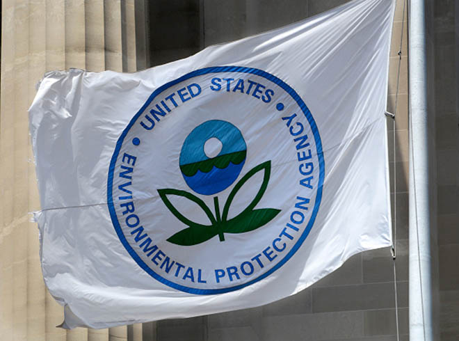
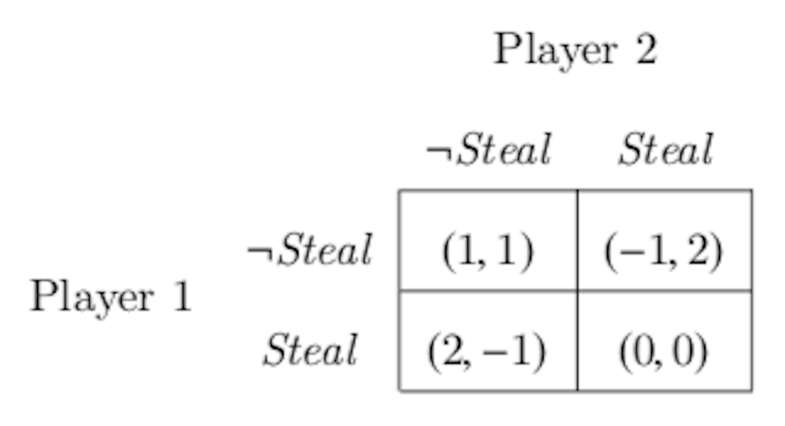
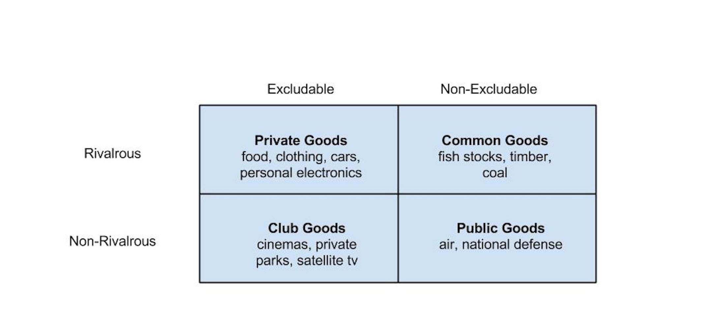
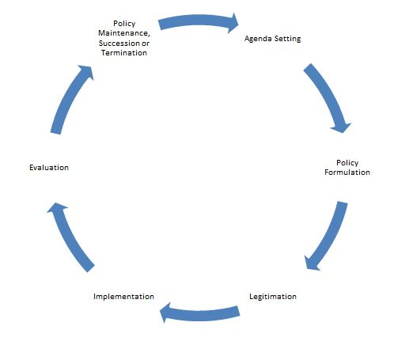

  
```{r setup, include=FALSE}
knitr::opts_chunk$set(warning = FALSE, message = FALSE, 
                      fig.retina = 3, fig.align = "center")
```

```{r xaringanExtra, echo=FALSE}
xaringanExtra::use_webcam()
```

# Environmental Policymaking

.pull-left[
<figure>
  
</figure>

]

.pull-right[

**POLI 307: Environmental Policy**

**Spring 2021**

.light[Matthew Nowlin, PhD<br>
Department of Political Science<br>
College of Charleston
]

]


---

class: title title-2

# Topic Overview 

.pull-left[
**Collective-Action Problems** 

**Institutions**
* Markets 
* Governments 

**Environmental Policymaking** 
* Context
* Process
* Structural Factors 
]

.pull-right[
</br>
<figure>
  
</figure>
]


---

class: title title-2

# Collective Action Problems 

**Situations that arise when the goals of the individual conflict with those of the group**

--

* Individual _benefits_ and Collective _costs_

--

**Examples** 
* _Externalities_ 
* _Common-pool goods_ 
* _Dirty dishes_ 
* _Slackers with group work_ 

---

class: center, middle

# How are collective-action problems addressed? 

---

class: title title-2

# Institutions 

**Institutions are the humanly devised constraints that structure political, economic, and social interaction**

--

</br>

**Institutions consist of both informal constraints (sanctions, taboos, customs, traditions, and codes of conduct), and formal rules (constitutions, laws, property rights)** 

--

</br>

**Markets** and **Governments** 

---

class: title title-2

# Markets 

**Markets are decentralized institutions that promote voluntary exchange between buyers and sellers** 

--

**Market rules** 
* Medium of exchange 
* Way to communicate price 
* _Property rights_ 

--

**Exchange provides gains from trade** 

--

**Markets provide the most _efficient_ allocation of resources** 

---

class: title title-2

# Two Households 

</br>

.pull-left[
<figure>
  
</figure>
]

.pull-right[
<figure>
  
</figure>
]

---

class: center, middle

# What can go wrong? 

---

<figure>
  
</figure>

---

class: title title-2

# Market Failures 

--

.pull-left[
**Externalities** 
* Pollution 

**Common-pool goods** 
* Open pasture

**Public goods** 
* Clean air
]

--

.pull-right[
**Insufficient competition** 
* Monopolies

**Asymmetric information** 
* Used car
]

---

class: title title-2

# Types of Goods 

<figure>
  
</figure>


---

class: title title-2

# Governments

**Public Policy**: The outcomes of government processes that are aimed at alleviating a societal _problem_  

--

**Problems vs Conditions** 
* **Problems**: Something that can be addressed 

* **Conditions**: Just happens, can't be stopped 

--

**What is the _cause_ of the "problem"?** 

---

class: title title-2

# Governments 

**Environmental Policy**: Government action (policy) related to the natural environment 

--

**Includes (among other things)**: Public lands and waters; wilderness; wildlife; pollution; ecosystem services; human health and safety; energy use; transportation; urban design and building standards; agriculture and food production; and human population growth

--

**Policies take multiple _forms_**: Legislation, executive orders, agency rules and regulations, and court decisions 


---

class: title title-2

# Context of Policymaking 

--

**Current Circumstances**
* _Focusing events_: Major events that galvanize attention on a particular issue such as a crisis or a disaster
* Public opinion 
* Other priorities  

--

**Economic Conditions** 
* Bad economy, less interest in other things 
* Cost of proposal 


---

class: title title-2

# Context of Policymaking 

**Politics** 
* Elections 
* Constituent/interest group support 
* Party support 

--

**Values and Culture** 
* What is acceptable to the public (and others) 

---

class: title title-2

# The Policy Process 

--

**The Stages Model** 

.pull-left[
1. Problem identification and definition
2. Agenda setting
3. Policy formulation
4. Policy legitimation
5. Policy implementation
6. Policy evaluation
]

.pull-right[
<figure>
  
</figure>
]

---

class: title title-2

# The Stages Model 


.pull-left[
**1. Problem identification and definition** 
* Is something a _problem_ 
* How is the problem _understood_ 
* These are debated 
] 

--

.pull-right[
**Framing** 

* Give meaning and context to information

<figure>
  
</figure>
]

---

class: title title-2

# The Stages Model 

**2. Agenda Setting** 

--

* _Policy agenda_: The issues currently being addressed by the policymaking system 

--

* _Agenda-setting_: The process through which policy issues reach the agenda

--

**Space on the agenda is finite and competitive** 


---

class: title title-2

# The Stages Model 

**2. Agenda Setting** 


**Getting on the agenda = Gaining attention** 

--

* _Mobilization_: individuals and organized groups bring attention to a problem   

--

* _Focusing events_ 

--

* _Policy entrepreneurs_: individuals willing to invest resources into achieving a policy goal 

--

* _Public "mood"_: how concerned is the public about the problem? 

---

class: title title-2

# The Stages Model 

**3. Policy Formulation** 
* What should be done about a problem? 
* Involves technical analysis and politics 
* **Solution aversion** 

--

**Policy design**: The content of the policy  
.pull-left[
* Policy goals 
* Causal framework 
* Policy instruments
]
.pull-right[
* Targets of the policy 
* Implementation structure
]

---

class: title title-2

# Environmental Policy Goals 

--

**The outcomes that policymakers want the policy to achieve** 

--

* For environmental policy, policy goals are typically broadly defined as some level of environmental protection, harm reduction, or improved management of a natural resource 

* _A reduction in the amount of greenhouse gases being emitted into the atmosphere_  

---

class: title title-2

# Causal Framework 

**The theory that connects the policy (_p_) to the desired outcome (_Y_)** 

--

* $\text{Y} = \text{p} + \omega$ 

* _How would a carbon tax reduce emissions_? 

--

* _Uncertainty_: can be reduced with more data

--

* _Ambiguity_: can not necessarily be reduced with more data  

---

class: title title-2

# Policy Instruments 

**The means of achieving policy goals** 

* Policy instrument $\rightarrow$ Policy goal

--

**Four categories** 
* Using markets: _carbon tax_  
* Creating markets: _cap-and-trade_ 
* Using environmental regulations: _command-and-control_  
* Engaging the public: _provide information_ 

---

class: title title-2

# Implementation Structure 

**Implementation structures include the agencies; state and local governments; and other actors that are involved in implementing a policy**

--

* Who is going to carry out the policy and how are they going to do it? 

---

class: title title-2

# The Stages Model 

**4. Policy Legitimation** 
* A proposed policy becomes law 

--

.pull-left[
<figure>
<center>
  
</figure>
]

--

.pull-right[
<center>
<figure>
  
</figure>
]

---

class: title title-2

# The Stages Model 

**5. Policy Implementation** 

**Process by which policies enacted by government are put into effect by the relevant agencies** 

--

* Implementation often involves **delegation** 
 * Agencies must define "_swimmable_" waters 

--

* Implementation often involves **policy creation**
  * EPA makes a regulation under the authority of the Clean Air Act 
 
---

class: title title-2

# The Stages Model 

**6. Policy Evaluation** 

**Measurement and assessment of policy and program effects, including successes and failures** 

--

**Determine**
.pull-left[
* Is a policy working? 
* Causality
* How to measure
* Where to get data? 
]

--

.pull-right[
<br>
_Was the Kyoto Protocol successful_? 
]


---

class: title title-2

# Structural Factors 

**Check and Balances** 

| Congress | President | Courts 
--- | --- | --- | --- 
**Legislative** | **make laws** | recommend laws, veto, regulations | review laws  
**Executive** | override vetos, oversight | **enforce and implement laws** | review executive acts 
**Judicial** | advise and consent | pardon, nominate judges | **interpret laws** 

---

class: title title-2

# Structural Factors 

**Federalism** 
* A system of government in which there is a national level of government with various sub- national governmental units

--

**Fragmentation** 
* Policymaking authority is diffused across the branches of government, the states, and civil society 

---

class: title title-2 

# Other Factors 

**Governmental tendencies that result from the context, process, and structural factors of policymaking** 

--

**Incrementalism**: small changes made over time 

--

**Reactionary**: governments respond to problems rather than be proactive to prevent a problem 

--

**Pluralism**: competition among different groups ensures that no single group will dominate government 


