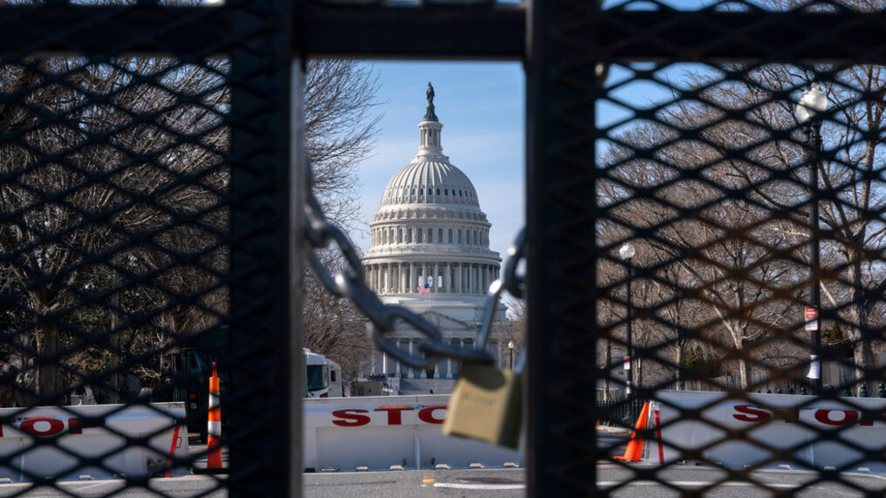
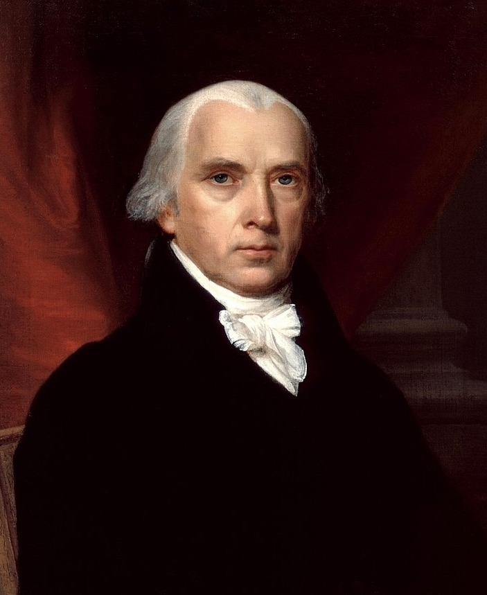
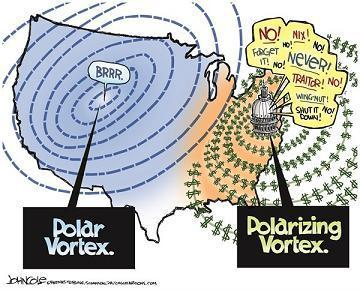
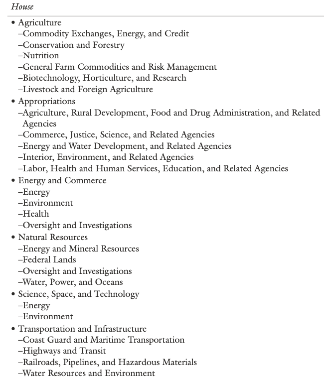
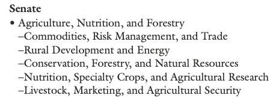
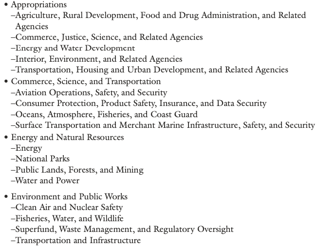
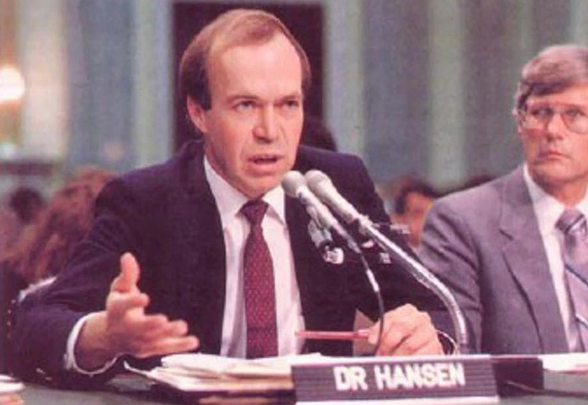
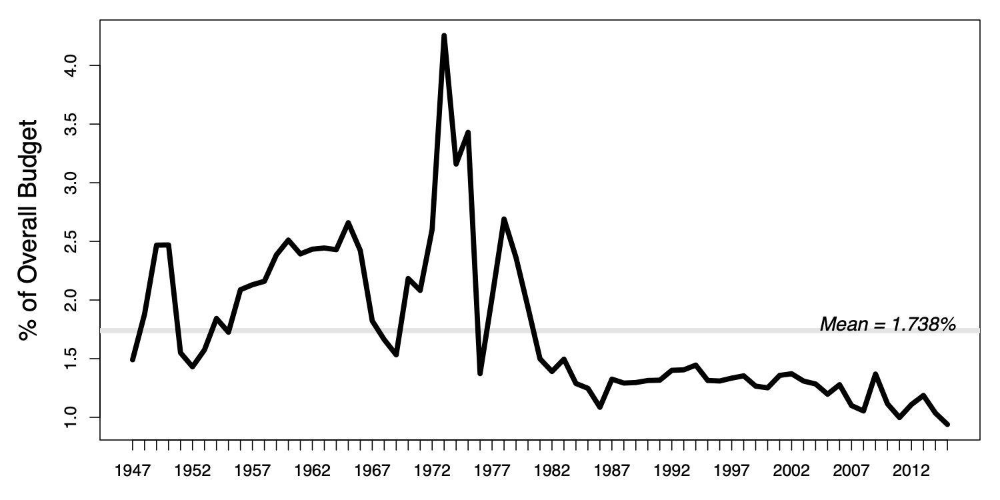
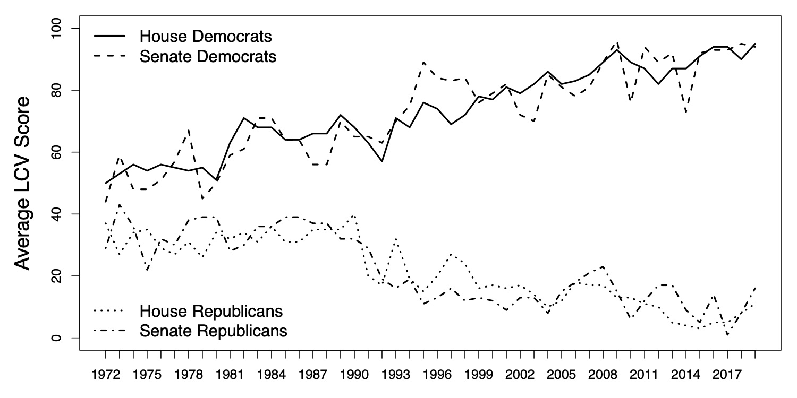

  
```{r setup, include=FALSE}
knitr::opts_chunk$set(warning = FALSE, message = FALSE, 
                      fig.retina = 3, fig.align = "center")
```


# Congress and Environmental Policy

.pull-left[
<figure>
  
</figure>

]

.pull-right[

**POLI 307: Environmental Policy**

**Spring 2022**

.light[Matthew Nowlin, PhD<br>
Department of Political Science<br>
College of Charleston
]

]


---

class: title title-2

# Topic Overview

.pull-left[
**Defining Official Actors**

**Congress**
* Article I 
* Congressional Powers 
* Legislation 
* Structural Features 
* Gridlock

]

.pull-right[
</br>
<figure>
  
</figure>
]

---


class: title title-2

# Official Actors 

**A participant in the policy process whose involvement is motivated or mandated by their _official position in a government agency or office_**

--

* In government 

--

* Elected officials and civil servants 

--

**Forms of environmental policy**: _legislation_, executive orders, rules and regulations, and court decisions 


---

class: title title-2

# Separation and Sharing of Powers

<figure>
<center>
  
</figure>

---

class: title title-2

# Separation and Sharing of Powers 

</br> 

| Congress | .light[President] | .light[Courts] 
--- | --- | --- | --- 
**Legislative** | **make laws** | .light[recommend laws, veto, regulations] | .light[review laws]  
**Executive** | override vetos, oversight | .light[enforce and implement laws] | .light[review executive acts] 
**Judicial** | advise and consent | .light[pardon, nominate judges] | .light[interpret laws] 


---

<iframe src="https://embed.polleverywhere.com/multiple_choice_polls/BAGW63D4L0cBy5o8pBcaG?controls=none&short_poll=true" width="800px" height="600px"></iframe>

---

class: title title-2

#  Congress

**Article I: The First Branch** 

.pull-left[
</br>
_In republican government, the legislative authority necessarily predominates_ 

-- Madison, _Federalist_ 51 
]

.pull-right[
<figure>
<center>
  
</figure>
]

---

class: title title-2

#  Congress

**Congressional powers** 

.pull-left[
* _Legislation_ 

* Budget appropriations 

* Confirm executive and court appointments 

* Oversee the executive branch 
]

.pull-right[
<figure>
<center>
  
</figure>
]

--

**Majority party exercises agenda control** 

---

class: title title-2

#  Congress

**How a bill becomes a law** 

.pull-left[
* Introduced 
* Assigned to committee 
* Passes committee 
* Passes full chamber 
* Passes other chamber 
* Signed by the president 
]


.pull-right[
<figure>
  
</figure>
]

---

class: title title-2

# Congress 

**Structural factors: Committees and Sub-Committees** 

.pull-left[
<figure>
  
</figure>
]

.pull-right[
<figure>
  
  
</figure>

]

---

class: title title-2

# Congress 

 **Structural factors: Committees and Sub-Committees** 

* Congressional committees anchor policy subsystems 

--

* **Authorizing** vs. **Appropriation** committees

--

* Hold hearings to gather information

--

* Bills are amended in committee, but most die in committee 

--

* Chairs of committees are important party leaders 

--

* Create multiple access and veto points for policy actors 


---

class: title title-2

# Congress 

**Environmental legislation** 

--

* Substantive legislation peaked during the _environmentalism era_ 

--

* Incremental changes since the environmentalism era
  * _Green drift_ vs _Retrenchment_ 

---

class: title title-2

# Congress 

**Environmental legislation** 

* **Authorizing statues**: legislation that becomes public law 

--

* **Public law titles**: subsections of larger bills (laws)

--

* **Appropriations**: allocation of funding to agencies     
  * **Riders**: attachments to appropriation bills  


---

class: title title-2

# Congress 

**On the Congressional agenda** 

.pull-left[
.tiny[_I would like to draw three main conclusions. Number one, the earth is warmer in 1988 than at any time in the history of instrumental measurements. Number two, the global warming is now large enough that we can ascribe with a high degree of confidence a cause and effect relationship to the greenhouse effect. And number three, our computer climate simulations indicate that the greenhouse effect is already large enough to begin to effect the probability of extreme events such as summer heat waves_ 

-- James Hansen, June 1988
]
]

.pull-right[
<figure>
  
</figure>
]

---

class: title title-2

# Congressional Hearings
```{r, include=FALSE, message=FALSE}
envHEAR <- read.csv("data/US-Legislative-congressional_hearings-20.1_1.csv")
envHEAR <- subset(envHEAR, majortopic==7)
envHEAR["envHearSUM"] <- 1
envHearAgg <- aggregate(envHEAR[c("envHearSUM")], by=list(year=envHEAR$year), FUN=sum)

library(ggplot2)
```

.pull-left[
```{r, echo=FALSE}
# Basic line plot with points
ggHear <- ggplot(data=envHearAgg, aes(x=year)) +
  geom_line(aes(y=envHearSUM), size=2) +
  # ylim(0, 5) +
  theme_bw() + 
  xlab("Year") + ylab("Number of Hearings")

ggHear + ggtitle("Congressional Hearings about the Environment") +
     theme(plot.title = element_text(lineheight=.8, face="bold"))
```
]

.pull-right[
* Steady increase during the _environmentalism era_ 
* Big spike in mid-to late 1980's
  * Response to Reagan 
  * Ozone layer and climate change
* Decline in _legislative_ hearings and increase in _oversight_ hearings
]

---

class: title title-2

# Environmental Legislation 
```{r, include=FALSE, message=FALSE}
envLEG <- read.csv("data/US-Legislative-public_laws_20.1_2.csv")
envLEG <- subset(envLEG, majortopic==7)
envLEG["envLegSUM"] <- 1
envLegAgg <- aggregate(envLEG[c("envLegSUM")], by=list(year=envLEG$year), FUN=sum)

envTitle <- read.csv("data/US-Legislative_Public_Laws_Titles_20.1.csv")
envTitle <- subset(envTitle, majortopic==7)
envTitle["envTitleSUM"] <- 1
envTitleAgg <- aggregate(envTitle[c("envTitleSUM")], by=list(year=envTitle$year), FUN=sum)

```

.pull-left[
```{r, echo=FALSE}
# Basic line plot with points
ggLeg <- ggplot(data=envLegAgg, aes(x=year, y=envLegSUM)) +
  geom_point() +
  geom_smooth() +
  # ylim(0, 5) +
  theme_bw() + 
  xlab("Year") + ylab("Number of Public Laws")

ggLeg + ggtitle("Environmental Public Laws") +
     theme(plot.title = element_text(lineheight=.8, face="bold"))
```
]

--

.pull-right[
```{r, echo=FALSE}
# Basic line plot with points
ggLeg <- ggplot(data=envTitleAgg, aes(x=year, y=envTitleSUM)) +
  geom_point() +
  geom_smooth() +
  # ylim(0, 5) +
  theme_bw() + 
  xlab("Year") + ylab("Number of Public Law Titles")

ggLeg + ggtitle("Environmental Public Law Titles") +
     theme(plot.title = element_text(lineheight=.8, face="bold"))
```
]

---

class: title title-2

# Environmental Budget Outlays 

<figure>
<center>
  
</figure>

---

class: title title-2

# Polarization 

<figure>
<center>
  
</figure>

---

class: title title-2

# Gridlock 

**Polarization** 

--

**Separation of Powers** 

--

**Complexity of environmental issues**

--

**Lack of public support**: 
* The paradox of public opinion

--

**Interest groups** 

--

**Lack of leadership** 


