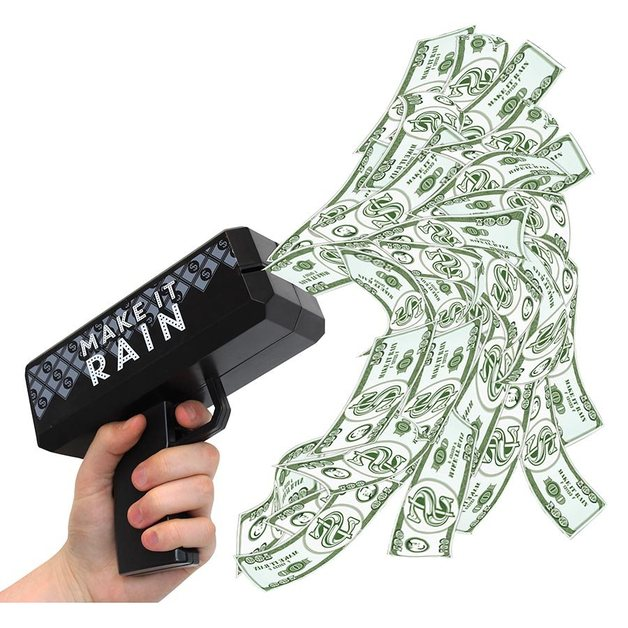
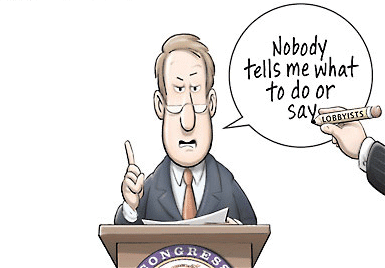

  
```{r setup, include=FALSE}
knitr::opts_chunk$set(warning = FALSE, message = FALSE, 
                      fig.retina = 3, fig.align = "center")
```

```{r xaringanExtra, echo=FALSE}
xaringanExtra::use_webcam()
```

# Unofficial Actors

.pull-left[
<figure>
  
</figure>

]

.pull-right[

**POLI 307: Environmental Policy**

**Spring 2021**

.light[Matthew Nowlin, PhD<br>
Department of Political Science<br>
College of Charleston
]

]


---

class: title title-2

# Topic Overview

.pull-left[
**Defining Unofficial Actors**

**Policy Subsystems** 

**Political Parties** 

**Interest Groups** 

**Public Opinion** 

**Media** 

]

.pull-right[
<figure>
  
</figure>
]

---


class: title title-2

# Unofficial Actors 

**Unofficial actors**: individuals and organizations that try to influence the actions of official actors (Congress, the president, the bureaucracy, and the courts) and the outcomes of elections 

--

**Outside government**: unofficial actors do _not_ have constitutionally or legally created incentives or mandates to be a part of the environmental policymaking process 

--

**But**, they are still an important factor in environmental policymaking


---

class: title title-2

# Policy Subsystems 

**Substantive issue alliances that cross institutional boundaries and include both governmental [official] and nongovernmental [unofficial] actors** 

--

* Subsystems are organized around a __policy domain__ 

--

**Policy domain**: Substantive area of policy over which participants in policy making compete and compromise (e.g., air pollution, land management)

---

class: title title-2

# Policy Subsystems 

**Iron triangles and Issue networks** 

<figure>
  
</figure>

---

class: title title-2

# Political Parties 

**Groups of people with similar interests who work together to create and implement policies** 

--

.pull-left[
**Parties are broad coalitions**

**Three roles**:
* In government
* As organizations 
* In the electorate 

]

.pull-right[
</br>
<center>
<figure>
  
</figure>
]


---

class: title title-2

# Political Parties 

<figure>
<center>
  
</figure>

---

class: title title-2

# Political Parties 

**Polarization**: Divergent views along ideological and/or partisan lines

--

**Republican**: _Republican ideology argues for individual liberty as opposed to government interference. Its preference for small government coincides with a pro-business, free-market attitude and thus an aversion to government control_ 

--

**Democratic**: _Democratic ideology is more commonly associated with liberalism and an acceptance of government involvement in the political, economic, and social lives of people_ 

---

class: title title-2

# Political Parties  

**Asymmetric Polarization** 

--

.pull-left[
* The parties are fundamentally different 
* _Democrats_ are a coalition of groups making demands on government 
* _Republicans_ are ideologically homogeneous 
]


.pull-right[
<figure>
  
</figure>
]

---

class: title title-2

# Party Platforms 

```{r, include=FALSE, message=FALSE}
envDem <- read.csv("data/envDemPlatform.csv")
envDem["demSUM"] <- 1
envDemAgg <- aggregate(envDem[c("demSUM")], by=list(year=envDem$year), FUN=sum)

envRep <- read.csv("data/envRepPlatform.csv")
envRep["RepSUM"] <- 1
envRepAgg <- aggregate(envRep[c("RepSUM")], by=list(year=envRep$year), FUN=sum)


df <- data.frame(merge(envDemAgg, envRepAgg, by="year"))

library(ggplot2)
```

.pull-left[
```{r, echo=FALSE}
# Basic line plot with points
ggplot(data=df, aes(x=year)) +
  geom_line(aes(y=demSUM), color="blue", size=2) +
  geom_line(aes(y=RepSUM), color="red", size=2) +
  theme_bw() + 
  xlab("Year") + ylab("Mentions of Environment")
```
]

--

.pull-right[
**Democrats**

1984: _The environmental legacy of Ronald Reagan will be long-lasting damage that can never truly be undone_ 

2020: _We must lead the world in taking on the climate crisis, not deny the science and accelerate the damage_ 
]

---

class: title title-2

# Party Platforms 

.pull-left[
```{r, echo=FALSE}
# Basic line plot with points
ggplot(data=df, aes(x=year)) +
  geom_line(aes(y=demSUM), color="blue", size=2) +
  geom_line(aes(y=RepSUM), color="red", size=2) +
  theme_bw() + 
  xlab("Year") + ylab("Mentions of Environment")
```
]

.pull-right[
**Republicans**

1980: _We strongly affirm that environmental protection must not become a cover for a "no-growth" policy and a shrinking economy_ 

2016: _The Environmental Protection Agency has rewritten laws to advance the Democrats' climate change agenda_ 
]

---

class: title title-2

# Interest Groups 

**An organized group of individuals or organizations that makes policy-related appeals to government**

--

**Environmental policy**
* Business 
* Environmental groups (Public) 
* Labor 

--

**"Left" (labor) and "right" (business) coalitions have been successful in blocking climate action**  


---

class: title title-2

# Interest Groups 

**Types of interest groups** 

.pull-left[
</br> 
**Business**

**Professional** 

**Public**

**Ideological**
]

.pull-right[
<figure>
<center>
  
</figure> 
]

---

class: title title-2

# Environmental Interest Groups 

--

.pull-left[
__Mainstream__ 
* Sierra Club
* Environmental Defense Fund

__Greens__
* Greenpeace 
* Earth First! 
]  
  
--

.pull-right[
__Grassroots__ 
* Organized within local area 

**Climate change**
* Sunrise Movement 
]


---

class: title title-2 

# What Interest Groups Do

.pull-left[
**What people think they do ...** 
<figure>
  
</figure>
]


--

.pull-right[
**... what they actually do**
* Pursue _insider_ and _outsider_ strategies
* Insider: lobby government officials 
* Outsider: support candidates, mobilize members, protests
]

---

class: title title-2

# Interest Groups: Theories 

**Pluralism**

--

**Groups are mobilized in response to changes in society and/or the _policymaking_ environment** 

--

**Mobilization**: The process by which people or groups motivated to take action, such as through lobbying, protest, or any other form of expression in response to an issue or problem 

--

**But**, interest groups often arise _in response_ to government activity 

---

class: title title-2

# Interest Groups: Theories 

**Mobilization and Counter-Mobilization**

<figure>
<center>
  
</figure>


---

class: title title-2

# Interest Groups: Theories 

**Elitism** 

--

.pull-left[
</br>

Policy demands flow downward from the elite not upwards from the public 
]

.pull-right[
<figure>
  
</figure>
]

---

class: title title-2

# Interest Group Influence 

**Mobilization and Spending** 

<figure>
  
</figure>

---

class: title title-2

# Interest Group Influence 

**Senator James Inhofe (R-Oklahoma)** 

</br>

.pull-left[
<figure>
  
</figure>
]

--

.pull-right[
<figure>
  
</figure>
]

---

class: title title-2

# Interest Group Influence 

"It’s not only about the money, having money helps, but the other side will always have more and they don’t always win"

.small[-Wesley Warren, _Natural Resources Defense Council_]

--

* On salient and contentious issues both sides tend to be well-resourced 

--

* Interest groups tend to support their friends and allies  

--

* But, business interests have an advantage when issues aren't salient and they can be active in each stage of the process

---

class: title title-2 

# Public Opinion 

.pull-left[
**Public opinion provides a foundation for government action** 
]

.pull-right[
<figure>
<center>
  
</figure>
]

--

</br> 
_Broad public support in favor of environmental protection provides legitimacy for those working on its behalf_ 

---

class: title title-2 

# Public Opinion 

.pull-left[
* In general, the public is __not__ consistently liberal or conservative 

* Only the most **knowledgeable** about politics tend to be ideologically consistent

* Elite and **party** cues
]

.pull-right[
<figure>
<center>
  
</figure>
]

---

class: title title-2

# Public Opinion 

**Two dimensions of ideology: Social and economic** 

<figure>
<center>
  
</figure>

???
from: https://navigatorresearch.org/public-opinion-on-the-vote-2020-election-poll-issue-analysis/

---

class: title title-2

# Public Opinion 

**Two dimensions of ideology: Social and economic** 

<figure>
<center>
  
</figure>

???
from: https://navigatorresearch.org/public-opinion-on-the-vote-2020-election-poll-issue-analysis/

---

class: title title-2 

# Public Opinion 

**But,**

<figure>
<center>
  
</figure>

---

class: title title-2 

# Public Opinion 

**And**

<figure>
<center>
  
</figure>

---

class: title title-2 

# Public Opinion 

<figure>
<center>
  
</figure>

---

class: title title-2 

# Public Opinion 

```{r, include=FALSE, message=FALSE}
envMood <- read.csv("data/envMood.csv")
envGallup <- read.csv("data/envGallup.csv")

envMood$percent <- envMood$percent*100
envGallup$percent <- envGallup$percent*100

library(ggplot2)
```

.pull-left[
```{r, echo=FALSE}
# Basic line plot with points
ggMood <- ggplot(data=envMood, aes(x=year)) +
  geom_line(aes(y=percent), size=2) +
  ylim(50, 100) +
  theme_bw() + 
  xlab("Year") + ylab("Environmental Mood")
  
ggMood + ggtitle("Support for Environmental Action among the US Public") +
     theme(plot.title = element_text(lineheight=.8, face="bold"))
```
]


--

.pull-right[
```{r, echo=FALSE}
# Basic line plot with points
ggGallup <- ggplot(data=envGallup, aes(x=year)) +
  geom_line(aes(y=percent), size=2) +
  ylim(0, 5) +
  theme_bw() + 
  xlab("Year") + ylab("Percent")

ggGallup + ggtitle("Environment the Most Imporant Problem among the US Public") +
     theme(plot.title = element_text(lineheight=.8, face="bold"))
```
]


---

class: title title-2 

# Public Opinion 

**The Paradox of Public Opinion on the Environment** 

In general, support for addressing environmental problems is high among the public, **but** other issues (the economy, healthcare) tend to be more important 

--

* Other issues crowd out the agenda, even as the public supports action on environmental issues 


---

class: title title-2 

# Public Opinion 


**Polarization** 

Following elite and party cues, the public is polarized over environmental issues. Particularly those that are most engaged  

--

**Thermostatic** 

Like a thermostat, public support for environmental policy increases (decreases) as government action on the environment decreases (increases)

---

class: title title-2 

# Public Opinion on Climate Change

<figure>
<center>
  
</figure>

---

class: title title-2

# Media 

--

**Three different types**
* Broadcast: radio and television
* Print: newspapers and magazines
* Internet: websites of traditional sources 

--

**Alternative media** 
* Social media 
* Data journalism 
* _Activist_ or _Clickivist_? 

---

class: title title-2

# Media 
```{r, include=FALSE, message=FALSE}
envNYT <- read.csv("data/envNYT.csv")
envNYT["envSUM"] <- 1
envAgg <- aggregate(envNYT[c("envSUM")], by=list(year=envNYT$year), FUN=sum)


```

.pull-left[
**Media attention**
* Framing and priming
* Complex science 
* Media ownership
* "Both sides"
]


.pull-right[
```{r, echo=FALSE}
# Basic line plot with points
ggNYT <- ggplot(data=envAgg, aes(x=year)) +
  geom_line(aes(y=envSUM), size=2) +
  # ylim(0, 5) +
  theme_bw() + 
  xlab("Year") + ylab("NYT Index")

ggNYT + ggtitle("Environment in the New York Times") +
     theme(plot.title = element_text(lineheight=.8, face="bold"))
```
]


