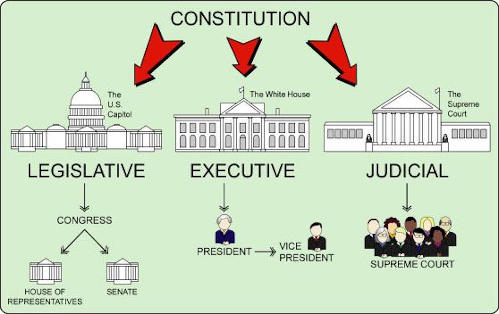
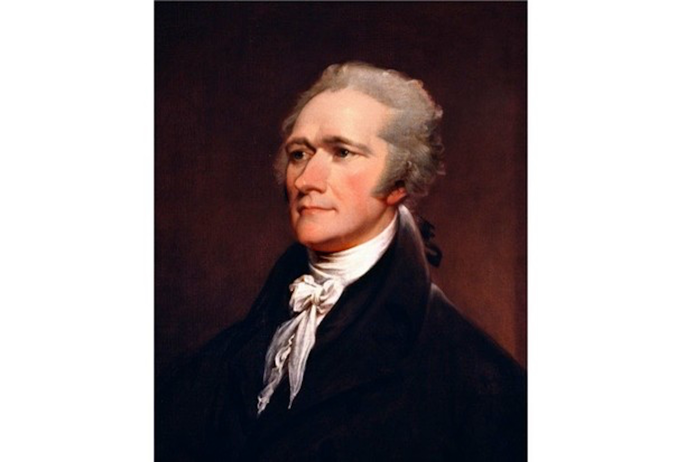
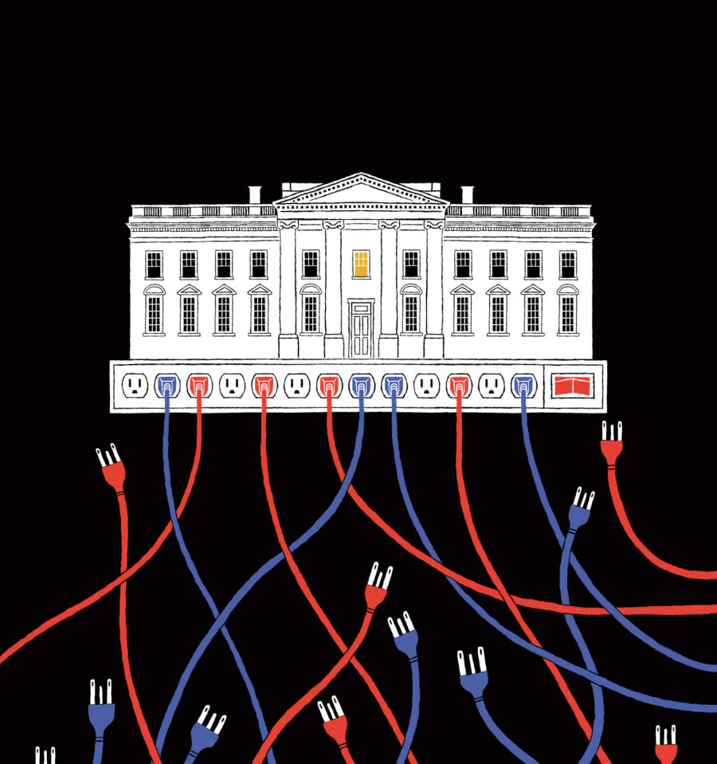
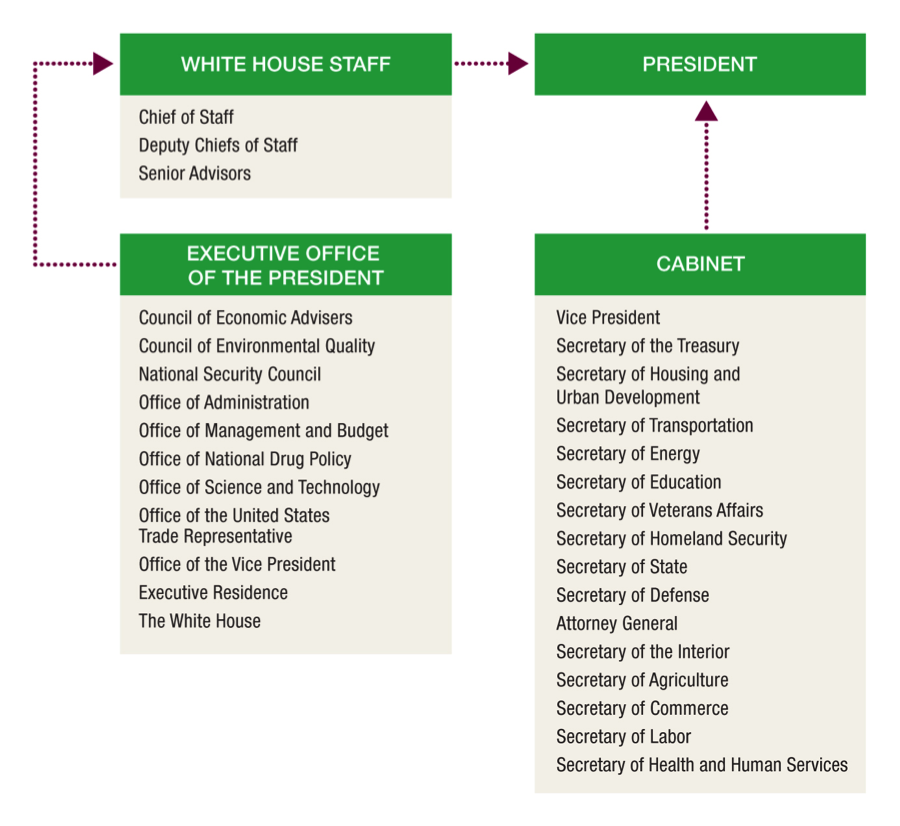
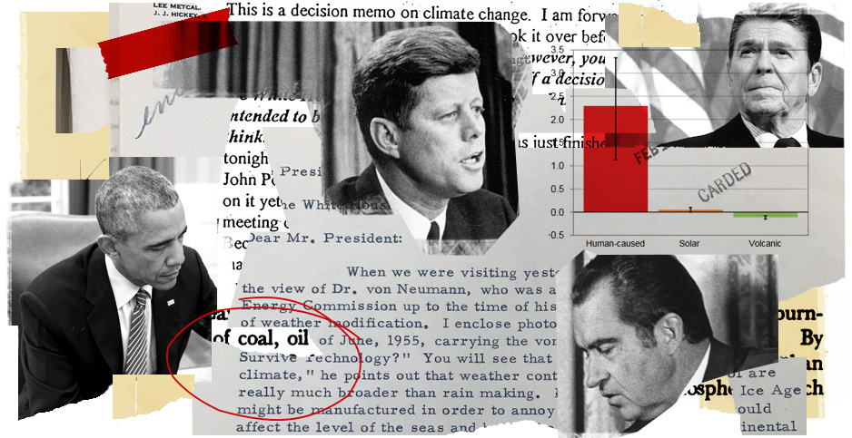
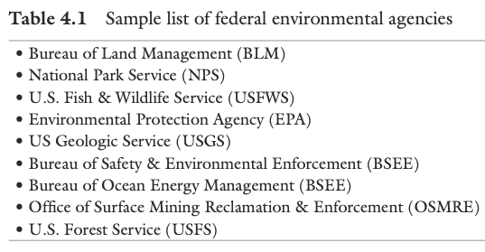
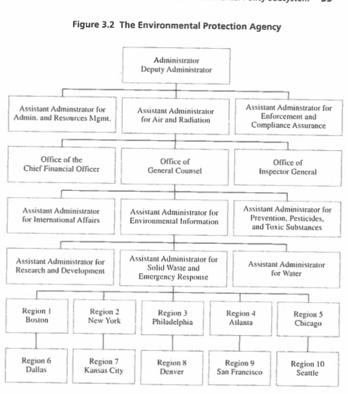
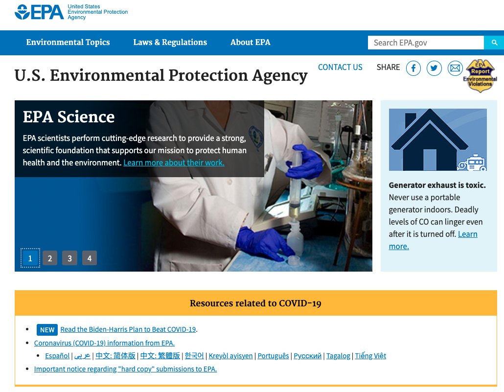
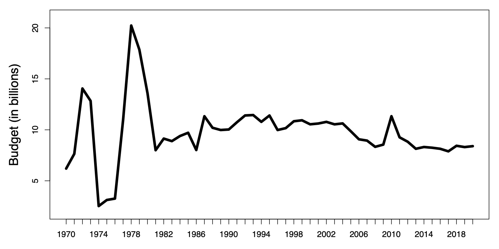

  
```{r setup, include=FALSE}
knitr::opts_chunk$set(warning = FALSE, message = FALSE, 
                      fig.retina = 3, fig.align = "center")
```

# The Executive and Environmental Policy

.pull-left[
<figure>
  
</figure>

]

.pull-right[

**POLI 307: Environmental Policy**

**Spring 2022**

.light[Matthew Nowlin, PhD<br>
Department of Political Science<br>
College of Charleston
]

]


---

class: title title-2

# Topic Overview

.pull-left[
**The President**
* Article II
* Powers 
* Roles
* The Environmental Presidency 
]

.pull-right[
**Agencies**
* Bureaucracy
* What agencies do 
* The EPA 
* Delegation and oversight
]

---

class: title title-2

# Separation and Sharing of Powers

.pull-left[
**Executive branch forms of policy** 
* Executive agreements 
* Executive orders 
* **Rules and regulations** 

**Agencies are part of policy subsystems** 
]


.pull-right[
</br>
<figure>
<center>
  
</figure>
]

---

class: title title-2

# Separation and Sharing of Powers 

</br> 

| .light[Congress] | President | .light[Courts] 
--- | --- | --- | --- 
**Legislative** | .light[make laws] | recommend laws, veto, regulations | .light[review laws]  
**Executive** | .light[override vetos, oversight] | **enforce and implement laws** | .light[review executive acts] 
**Judicial** | .light[advise and consent] | pardon, nominate judges | .light[interpret laws] 


---

<iframe src="https://embed.polleverywhere.com/multiple_choice_polls/CogZakHzFC8J8sJWbr8Hb?controls=none&short_poll=true" width="800px" height="600px"></iframe>

---

class: title title-2

#  The President

**Unitary Executive** 

.pull-left[
.tiny[_Energy in the executive is a leading character in the definition of good government. It is essential to the protection of the community against foreign attacks; it is not less essential to the steady administration of the laws; to the protection of property against those irregular and high-handed combinations which sometimes interrupt the ordinary course of justice; to the security of liberty against the enterprises and assaults of ambition, of faction, and of anarchy._ 

-- Hamilton, _Federalist_ 69 
]
]

.pull-right[
<figure>
<center>
  
</figure>
]


---

class: title title-2

#  The President

**Article II: Presidential Powers** 

--

.pull-left[
* _Execute the law_ ("take care" clause)
* Exercise military authority 
* Issue pardons
* Engage in diplomacy 
* Veto legislation 
* Make appointments 
]

.pull-right[
<center>
<figure>
  
</figure>
]

---

class: title title-2

#  The President

**Presidential Powers** 

**Direct powers**: The forms of public policy the president can make directly  

--

* _Executive Agreements_: Agreements made between the US and a foreign government(s) 

--

* _Executive Orders_: An official means by which the president can instruct federal agencies on how to execute laws passed by Congress

---

class: title title-2

#  The President

**Presidential Powers** 

__Indirect powers__: The president can (try to) influence others to act 
* _Going public_ or _the Bully Pulpit_ 

--

**Chief executive** 
* Appointments 
* Oversight of executive agencies 
* Executive orders

---

class: title title-2

# The President 

**The Administrative Presidency** 

.pull-left[
* Appointments
* Policy coordination
* Budget process 
* Regulatory oversight
  * Benefit-cost analysis 
  * Major regulations (over $100 million) receive OMB review 
]


.pull-right[
<figure>
  
</figure>
]

---

<iframe src="https://embed.polleverywhere.com/multiple_choice_polls/yqABQWidtbnMBOhCzWOnU?controls=none&short_poll=true" width="800px" height="600px"></iframe>

---

class: title title-2

# The President 


**Roles of the president** 

--

* Commander-in-Chief 

--

* Chief diplomat

--

* Chief executive 

--

* Legislative leader 

--

* Party leader 

---

class: title title-2

# The President 

**The Environmental Presidency: Executive Orders** 


.pull-left[
Democratic | Executive Orders 
--- | --- | --- 
Johnson | 4 
Carter | 9
Clinton | 22 
Obama | 15
Biden | 1*
]

.pull-right[
Republican | Executive Orders 
--- | --- | ---
Nixon | 13
Ford | 2
Reagan | 3
HW Bush | 4 
W Bush | 8
Trump | 6
]

---

class: title title-2

# The President 

```{r, include=FALSE, message=FALSE}
envSU <- read.csv("data/US-Executive_State_of_the_Union_Speeches-20.csv")
envSU <- subset(envSU, majortopic==7)
envSU["envSUSUM"] <- 1
envSUAgg <- aggregate(envSU[c("envSUSUM")], by=list(year=envSU$year), FUN=sum)

library(ggplot2)
```

.pull-left[
```{r, echo=FALSE}
# Basic line plot with points
ggSU <- ggplot(data=envSUAgg, aes(x=year)) +
  geom_line(aes(y=envSUSUM), size=2) +
  # ylim(0, 5) +
  theme_bw() + 
  xlab("Year") + ylab("Number of Mentions")

ggSU + ggtitle("Mentions of the Environment in the State of the Union") +
     theme(plot.title = element_text(lineheight=.8, face="bold"))
```
]

.pull-right[
**State of the Union** 
* Legislative leader 
* Party leader 
* Going public 
* Agenda-setting 
]

---

class: title title-2

# The President 

**The Environmental Presidency** 

.pull-left[

* Opportunistic Leaders

* Frustrated Underachievers

* Rollback Advocates

]

.pull-right[
<figure>
  
</figure>
]

---

class: title title-2

# The President 

**The Environmental Presidency** 

.pull-left-3[
**Opportunistic Leaders** 
* Nixon 
* HW Bush 
]

--

.pull-middle-3[
**Frustrated Underachievers** 
* Clinton 
* Obama
]

--

.pull-right-3[
**Rollback Advocates**
* Ford?
* Reagan 
* W Bush 
* Trump 
]

--

**Biden?** 

---

class: title title-2

# Environmental Bureaucracy 

**Bureaucracy**: The complex **structure** of offices, tasks, rules, and principles of organization that are employed by all large-scale institutions to coordinate the work of their personnel

--

.pull-left[
* A mission defined by top officials

* Fixed jurisdictions within the organization

* Authority graded from top to bottom
]


--


.pull-right[
* Management by written documents

* Management by career experts

* Management by rules
]

---

class: title title-2

# Environmental Bureaucracy 

**Why Bureaucracy?**  

--

* Bureaucratic organization _enhances efficiency_ through division of labor and specialization

--

* Bureaucracies _allow governments to operate_ by allowing large-scale coordination of individuals working on a task


---

class: title title-2

# Environmental Bureaucracy 

.pull-left[
**What agencies do** 
* Implement policy 
* Interpret vague legislative language
* Create **regulations** 
]

.pull-right[
</br>
<figure>
<center>
  
</figure>
]

---

<iframe src="https://embed.polleverywhere.com/multiple_choice_polls/03ZR56368zt93LTTzAY3C?controls=none&short_poll=true" width="800px" height="600px"></iframe>

---

class: title title-2

# Environmental Bureaucracy 

**The Environmental Protection Agency** 

.pull-left[
* Initiated by President Nixon in 1970
  * _Independent agency_
  * Administrator appointed by President and confirmed by the Senate
]

.pull-right[
<figure>
<center>
  
</figure>
]

---

class: title title-2

# Environmental Bureaucracy 

**The Environmental Protection Agency** 

.pull-left[
* Central agency responsible for implementing environmental policy

* _The mission of EPA is to protect human health and the environment_ 
]

.pull-right[
<figure>
<center>
  
</figure>
]

---

class: title title-2

# Environmental Bureaucracy 

**The Environmental Protection Agency** 

.pull-left[
* Organized by _media_ and _geographic regions_
  * Air and Radiation 
  * Chemical Safety and Pollution Prevention
  * Land and Emergency Management
  * Water 
]

.pull-right[
<figure>
  
</figure>
]

---

class: title title-2

# Environmental Bureaucracy 

**The Environmental Protection Agency** 

.pull-left[
**What the EPA Does** 
* Develop and enforce regulations

* Give grants

* Study environmental issues

* Public information 
]

.pull-right[
<figure>
  
</figure>
]

---

class: title title-2

# Environmental Bureaucracy: EPA Budget 

<figure>
<center>
  
</figure>

---

<iframe src="https://embed.polleverywhere.com/multiple_choice_polls/v2tdTjzg0jKQcUkK2vT51?controls=none&short_poll=true" width="800px" height="600px"></iframe>

---

class: title title-2

# Environmental Bureaucracy 

**Delegation and Oversight**

--

**Delegation of Authority**: _Congress provides policymaking power to the executive branch (i.e., the bureaucracy or federal agencies)_ 

--

**Delegation and Accountability** 

The People $\rightarrow$ Elected Officials $\rightarrow$ Executive Branch Agencies (Bureaucrats) 

---

class: title title-2

# Environmental Bureaucracy 

**Delegation and Oversight**

**Why Delegate?** 

--

* The bureaucracy has more expertise in these policy areas and more flexibility to make changes if necessary

--

* "Shift the responsibility" of decision-making to the agencies
  * Blame avoidance 

---

class: title title-2

# Environmental Bureaucracy 

**Delegation and Oversight**

**Bureaucracy and the Principal-Agent Relationship** 


--

* _Principal_: the supplier of policymaking authority delegates to an _agent_ - the recipient of policymaking authority 

--

* Principal-Agent Problem
    * The principal-agent relationship may be affected by the fact that each is motivated by their own interests, yet their interests may not be well aligned 

---

class: title title-2

# Environmental Bureaucracy 

**Delegation and Oversight**

**Elected officials use various oversight and control mechanisms to manage the bureaucracy** 

--

**President** 
* Appointment of sympathetic agency heads
* Regulatory review prior to final rule enactment
* Executive orders
* Changes in budget authority
* Bureaucratic reorganization plans

---

class: title title-2

# Environmental Bureaucracy 

**Delegation and Oversight**

**Elected officials use various oversight and control mechanisms to manage the bureaucracy** 

**Congress** 

.pull-left[
* Authorization of agency
* Legislative language restricting discretion
* Budgetary control
]

--

.pull-right[
* _Police patrol_ oversight: Active monitoring
* _Fire alarm_ oversight: React to complaints from citizens and/or interest groups
]

