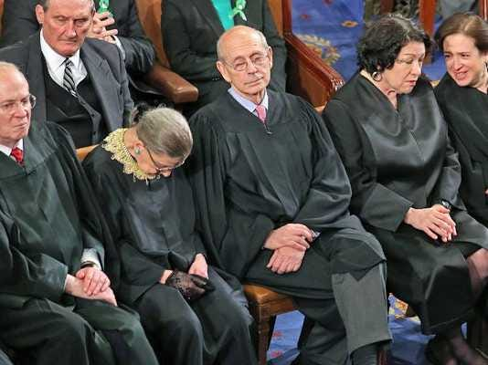
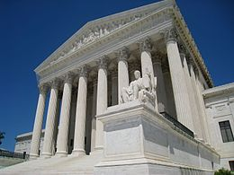
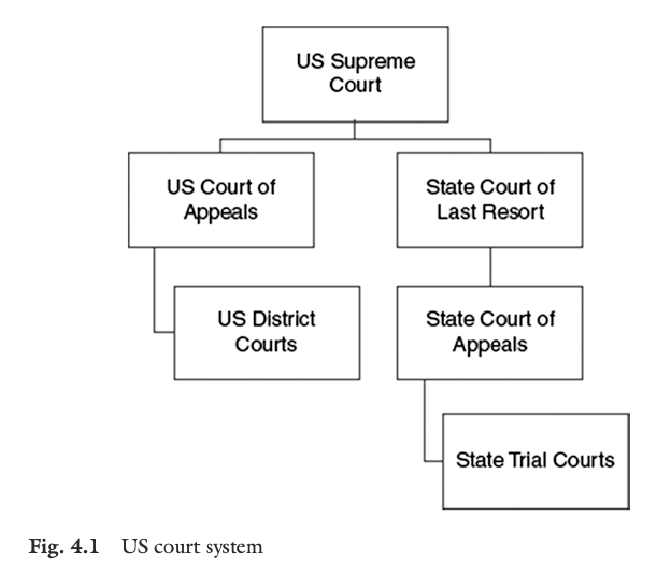

  
```{r setup, include=FALSE}
knitr::opts_chunk$set(warning = FALSE, message = FALSE, 
                      fig.retina = 3, fig.align = "center")
```

# The Courts and <br> Environmental Policy

.pull-left[
<figure>
  
</figure>

]

.pull-right[

**POLI 307: Environmental Policy**

**Spring 2022**

.light[Matthew Nowlin, PhD<br>
Department of Political Science<br>
College of Charleston
]

]


---

class: title title-2

# Topic Overview

.pull-left[
**The Courts**
* Article III
* Court system
* Judicial review
* How courts shape environmental policy 
* _Massachusetts v. EPA_ 

]

.pull-right[
</br>
<figure>
<center>
  
</figure>
]

---

class: title title-2

# Separation and Sharing of Powers

.pull-left[
**Judicial branch forms of policy** 

**Court decisions** 
* Create _legal precedents_: Prior cases whose principles are used by judges as the bases for their decisions in present cases
* Review actions of the other branches and the states

]


.pull-right[
</br>
<figure>
<center>
  
</figure>
]

---

class: title title-2

# Separation and Sharing of Powers 

</br> 

| .light[Congress] | .light[President] | Courts 
--- | --- | --- | --- 
**Legislative** | .light[make laws] | .light[recommend laws, veto, regulations] | review laws  
**Executive** | .light[override vetos, oversight] | .light[enforce and implement laws] | review executive acts 
**Judicial** | .light[advise and consent] | .light[pardon, nominate judges] | **interpret laws** 


---

class: title title-2

#  The Courts

**Article III**

--

_The judicial Power of the United States, shall be vested in one supreme Court, and in such inferior Courts as the Congress may from time to time ordain and establish_

.pull-left[
* Judiciary Act of 1789 
]

.pull-right[
<center>
<figure>
  
</figure>
]

---

class: title title-2

# The Courts 

.pull-left[
**Dual Court System** 
* Federal and state
* Three types of law 
  * Public  
  * Criminal 
  * Civil
]

.pull-right[
<figure>
  
</figure>
]

---

class: title title-2

# The Courts 

**Judicial Review** 

--

_The power of the courts to declare actions of the legislative and executive branches invalid or unconstitutional_ 

--

* _Marbury v. Madison_ (1803)

--

.small[_... more rational to suppose, that the courts were designed to be an intermediate body between the people and the legislature, in order, among other things, to keep the latter within the limits assigned to their authority_ 

-Hamilton, _Federalist_ 78
] 

---

class: title title-2

# The Courts 

**The courts review environmental laws** 

**Sources of environmental laws** 

.pull-left[
* Statutes (Legislation)
* Executive orders
* Administrative rules and regulations
]

--

.pull-right[
* _Appellate court decisions_
* _Previous court decisions_ 
  * _Stare decisis_: the court tends to follow its previous decisions
]

---

<iframe src="https://embed.polleverywhere.com/multiple_choice_polls/8K32dzMsuQNihLsndDL8b?controls=none&short_poll=true" width="800px" height="600px"></iframe>

---

class: title title-2

#  The Courts

**How Courts Shape Environmental Policy** 

--

1) Determine __standing__: _The right to sue_

--

* To establish standing: 
  * _Injury-in-fact_
  * _Causation_  
  * _Redressability_ 

---

class: title title-2

#  The Courts

**How Courts Shape Environmental Policy** 


2) Interpret the law: determine intent  

--

* Standard of review: how much _deference_ is given by the court

--

* _Chevron deference_  
  * _Chevron v NRDC_ (1984)
  * _Ambiguous_ language, _reasonable_ interpretation, _defer_ to agencies


---

class: title title-2

#  The Courts

**Example**: _Massachusetts v. EPA_ (2007)

* Several states, cities, and environmental groups petitioned to the EPA to regulate greenhouse gases emissions from vehicles under the Clean Air Act 

--

* In 2003, the EPA said "nope" 

--

* The petitioners appealed 

---

class: title title-2

#  The Courts

**Example**: _Massachusetts v. EPA_ (2007)

* The Supreme Court determined that the state of Massachusetts had standing 

--

* In 2007, in a 5-4 decisions the court ruled that the EPA can regulate vehicle emissions of GHGs if the EPA determines that GHGs "endanger public health or welfare" 

--

**To be continued ...** 

---

<iframe src="https://embed.polleverywhere.com/multiple_choice_polls/3Q4BvgngGqmFNspme3Bj0?controls=none&short_poll=true" width="800px" height="600px"></iframe>


