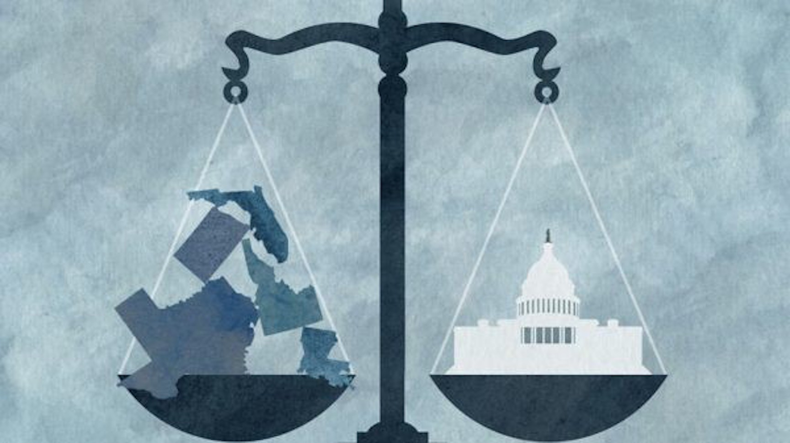
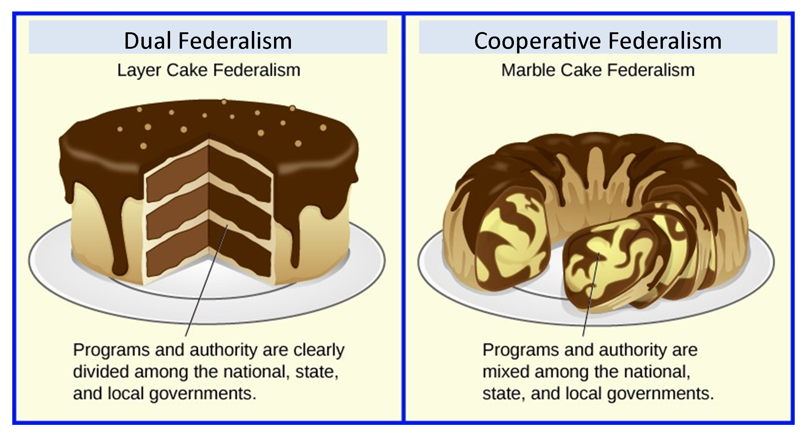
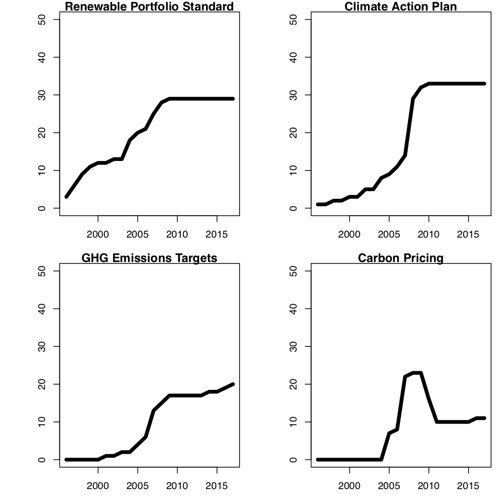
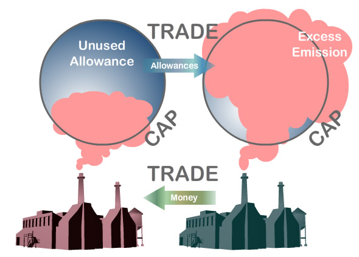

  
```{r setup, include=FALSE}
knitr::opts_chunk$set(warning = FALSE, message = FALSE, 
                      fig.retina = 3, fig.align = "center")
```

```{r xaringanExtra, echo=FALSE}
xaringanExtra::use_webcam()
```

# Federalism and Environmental Policy Design

.pull-left[
<figure>
  
</figure>

]

.pull-right[

**POLI 307: Environmental Policy**

**Spring 2021**

.light[Matthew Nowlin, PhD<br>
Department of Political Science<br>
College of Charleston
]

]


---

class: title title-2

# Topic Overview

.pull-left[
**Federalism** 
* Definition
* Concepts
* Historical Periods

**Environmental Policy Design** 
* Elements 
* Policy Instruments 

]

.pull-right[
</br>
<figure>
  
</figure>
]

---

class: title title-2

# Federalism 

**A system of constitutionally derived and apportioned authority where state and national government retain sovereignty yet at the same time are interdependent** 

--

**Constitutional division of powers between the national and the state governments** (DSW) 

--

**Preemption**

_Higher level government restricts authority of lower level government_  

---

class: title title-2

# Federalism 

**The Tenth Amendment** 

_The powers not delegated to the United States by the Constitution, nor prohibited by it to the States, are reserved to the States respectively, or to the people_ 

--

**National supremacy clause**
* Article VI, Section 2
* National laws take _preeminence_ over state laws

---

class: title title-2

# Federalism 

**Local Governments** 

--

**Dillon's Rule**
* Local government activity must be sanctioned by state governments 

--

**Home Rule**
* Provides for more autonomy for local governments

---

class: title title-2

# Federalism 

**Types of federalism** 
.pull-left[
* Dual federalism 
* Cooperative federalism 
* _Compensatory federalism_ 
]

--

.pull-right[
<figure>
<center>
  
</figure>
]

--

**With cooperative federalism the federal government delegates authority to the states**

---

class: title title-2

# Federalism 

**Delegation to States** 

--

* For delegation to occur states: 
	* Must develop regulatory standards _at least as stringent as the federal standards_ 
	* Must demonstrate capacity (funding, staff, and expertise)
	* Oversight: EPA $\rightarrow$ States 

---

class: title title-2

# Federalism 

**Budgetary Assistance**
* _Categorical grants_: assistance with the operations of delegated programs 
* _Infrastructure funds_: water and wastewater systems 

--

**State Innovation and Diffusion**
* States develop policies that are then adopted by other states or the federal government 


---

class: title title-2

# Federalism Eras 

**The Common Law and Conservation Era: Pre-1945** 

--

* States and the federal government had a shared interest in development 

--

* Shift to conservation in the late 1800s 

--

**Dual federalism**: States and the federal government had distinct spheres of power over separate policy areas 

---

class: title title-2

# Federalism Eras 

**Federal Assistance for State Environmental Problems: 1945–1962** 

--

* Federal government promoted environmental protection by providing research and financial assistance to states and localities

--

* Rising concern over pollution crossing state lines 

--

**Slow shift from _dual_ to _cooperative_ federalism** 

---

class: title title-2

# Federalism Eras 

**The Rise of the Modern Environmental Movement: 1962–1970** 

--

* Focus on federal agencies

<!-- 
: providing funding and guidance to states; government projects took environmental impacts into account -->

--

**Erecting the Federal Regulatory Infrastructure: 1970–1980** 

* Large number of federal environmental laws 

--

**Cooperative federalism**: Federal laws with delegated implementation and enforcement authority to states 

---

class: title title-2

# Federalism Eras 

**Extending and Refining Federal Regulatory Strategies: 1980–1990** 

--

* Slow and uneven process of shifting more authority to states 

--

**Regulatory Recoil and Limits on Federal Power: 1991-Present** 

--

* Reduction in regulatory burdens on states 


---

class: title title-2

# Federalism and Climate Change 

**Compensatory federalism**: One level of government _compensates_ for another level 

--

.pull-left[
**States and Climate Policy**
* Renewable Portfolio Standards
* Climate Action Plans 
* GHG Emission Targets 
* Carbon Pricing 
]


.pull-right[
<figure>
<center>
  
</figure>
]

---

class: title title-2

# The Policy Process 

**The Stages Model** 

.pull-left[
1. Problem identification and definition
2. Agenda setting
3. **Policy formulation** 
4. Policy legitimation
5. Policy implementation
6. Policy evaluation
]

.pull-right[
<figure>
  
</figure>
]

---

class: title title-2

# The Stages Model 

**3. Policy Formulation** 
* What should be done about a problem? 
* Involves technical analysis and politics 
* **Solution aversion** 

--

**Policy design**: The content of the policy  
.pull-left[
* Policy goals 
* Causal framework 
* **Policy instruments**
]
.pull-right[
* Targets of the policy 
* Implementation structure
]

---

class: title title-2

# Policy Instruments 

**The means of achieving policy goals** 

* Policy instrument $\rightarrow$ Policy goal

--

.pull-left[
**Four categories** 
* Using markets  
* Creating markets 
* Using environmental regulations  
* Engaging the public
]

.pull-right[
**Carrots, sticks, (and sermons)**
* Delegated
* Voluntary ("carrots")
* Mandated ("sticks")

]

---

class: title title-2

# Environmental Policy Instruments 

**Sticks** (_Using environmental regulations_)  

--

* **Command-and-Control**: 
  * _Command_: Top-down standards (performance or technology) 
  * _Control_: Substantive and procedural requirements, tight timetables, inspections, controls, penalties for noncompliance, and litigation 

--

* **Oversight**: 
  * Higher level government monitors lower level government 

---

class: title title-2

# Environmental Policy Instruments 

**Sticks** (_Using environmental regulations_)  

* **Technology Based**: 
  * Require a particular technology be used (e.g., scrubbers)

--

* **Permits and Inspections** 
  * _Permit_: limit on volume and type of pollution that can be discharged 
  * _Inspections_: ensure compliance 

---

class: title title-2

# Environmental Policy Instruments 

**Sticks** (_Using environmental regulations_)  

* **Enforcement** 
  * Occurs at both the federal and state level 

--

* **Unfunded Mandates** 
  * Requirements from the federal government without monetary assistance 
  * _Unfunded Mandates Reform Act of 1995_ 

---

class: title title-2

# Environmental Policy Instruments 

**Carrots** 

--

* **Voluntary Compliance** 
  * Firms and other organizations have clear expectations and the incentives and resources
  * Bottom-up: firms may impose requirements on themselves to avoid government regulation 
  * _Greenwashing_: firms appear more environmentally friendly than they actually are   
  
---

class: title title-2

# Environmental Policy Instruments 

**Carrots** 

* **Public Education** (_Engaging the public_; _Sermons_)
  * Provide information 
  * _Moral leadership_ 
  
--

* **Preventive Efforts** 
  * Produce reduction targets  

--

* **Technical Assistance** 
  * Grants and expertise 

---

class: title title-2

# Environmental Policy Instruments 

**Carrots**

* **Privatization** 
  * Contract out; waste disposal 

--

* **Partnerships** 
  * Federal-state; public-private 
  
---

class: title title-2

# Environmental Policy Instruments 

**Market-Based Approaches** 

_Seeks to influence behavior using pricing mechanisms instead of specific standards for levels or methods of pollution control_ 

--

* **Using markets**   
  * _User charges and tax policies_  

--

* **Creating markets** 
  * _Market development_ 

---

class: title title-2

# Environmental Policy Instruments 

**Market-Based Approaches** 

**Using markets**: policies aimed at affecting prices 

--

* Subsidize things we want _more_ of: renewable energy 

--

* Tax things we want _less_ of: pollution 


---

class: title title-2

# Environmental Policy Instruments 

**Market-Based Approaches**: Carbon Tax 

.pull-left[
Social cost $>$ Private cost (**Externality**)

Carbon tax = Marginal external cost

**What is the social cost of carbon?** 
]

.pull-right[
<figure>
  
</figure>
]


---

class: title title-2

# Environmental Policy Instruments 

**Market-Based Approaches** 

**Creating markets**: policies aimed at establishing property rights 

--

* Distribute allowances: pollution, fishing 

--

* Allow for the selling of excess allowances 


---

class: title title-2

# Environmental Policy Instruments 

**Market-Based Approaches** 

**Creating markets**: Cap-and-Trade

.pull-left[

Set over all cap 

Distribute allowances 

Create market for allowances 
]

.pull-right[
<figure>
  
</figure>
]


