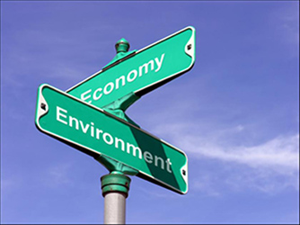
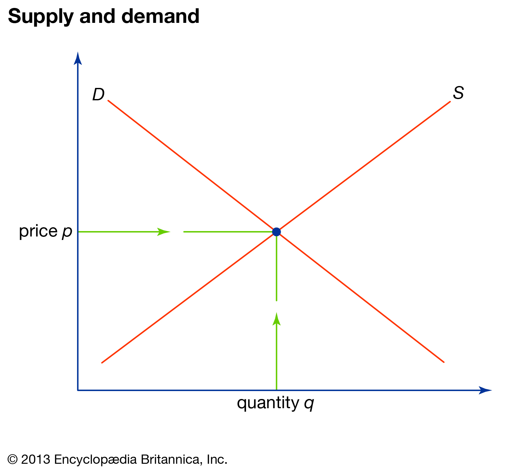
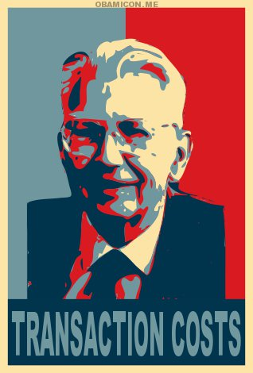
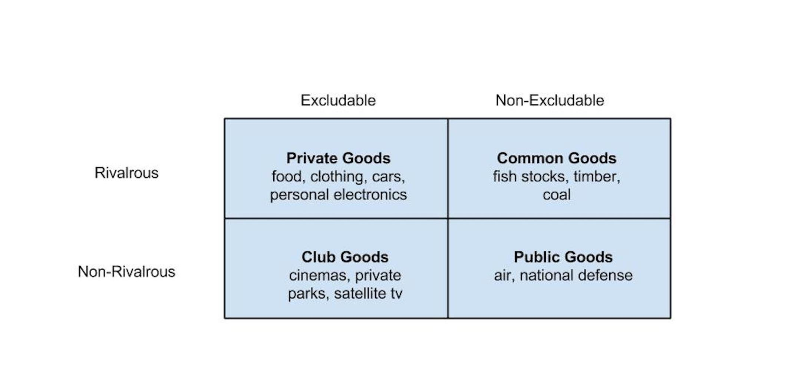
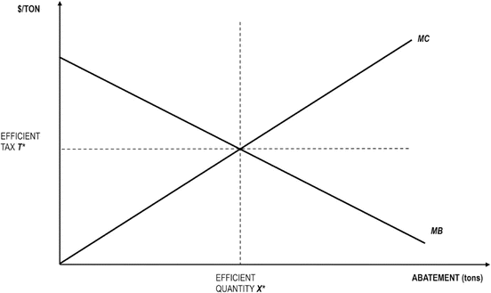
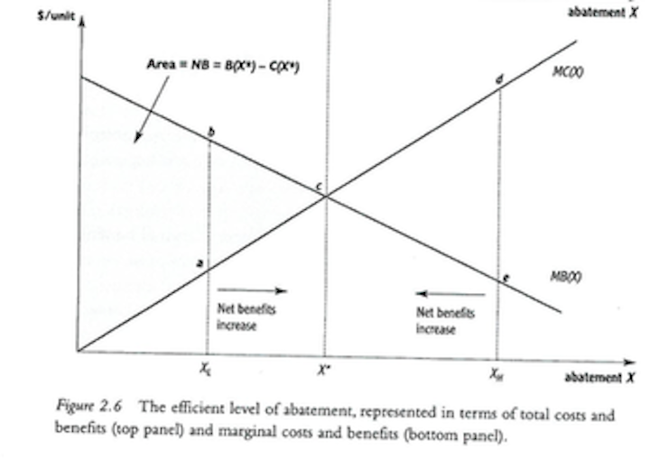

  
```{r setup, include=FALSE}
knitr::opts_chunk$set(warning = FALSE, message = FALSE, 
                      fig.retina = 3, fig.align = "center")
```

# Market-Based <br> Environmental Policy

.pull-left[
<figure>
  
</figure>

]

.pull-right[

**POLI 307: Environmental Policy**

**Spring 2022**

.light[Matthew Nowlin, PhD<br>
Department of Political Science<br>
College of Charleston
]

]


---

class: title title-2

# Topic Overview

.pull-left[
**Markets and Market-Based Policy**
* Markets and market-failures
* Coase Theorem
* Market-based policy

**Benefit-Cost Analysis** 


]

.pull-right[
</br>
<figure>
<center>
  
</figure>
]

---

class: title title-2

# Markets 

**A decentralized collection of buyers and sellers whose interactions determine the allocation of a good or a set of goods through exchange** 

--

.pull-left[
**Assumptions** 
* Perfect competition 
* Perfect information 
* _Perfectly complete_
]

--

.pull-right[
<figure>
<center>
  
</figure>
]


---

class: title title-2

# Market-Based Policy 

--

**Incorporate market principles into government policies** 

--

**Polluters have an incentive to reduce their emissions** 

--

.pull-left[
**Market rules** 
* Medium of exchange 
* Way to communicate price 
* _Property rights_ 
]


--

.pull-right[
**Market-based policy**

* Decentralized 
* Focus on aggregate outcomes 
* **Using markets** 
* **Creating markets** 
]


---

class: title title-2

# Market Failures 

**When assumptions are met, markets provide the most _efficient_ allocation of resources**

--

**Market failure**: Occurs when markets are _not_ providing the most efficient allocation of resources 

--

**Externality**: Market is not _perfectly complete_ 

--

</br>
**Market-based policies are intended to address efficiency concerns**

---

<iframe src="https://embed.polleverywhere.com/multiple_choice_polls/Jn2MiqSSyL0nLfZAaSpcW?controls=none&short_poll=true" width="800px" height="600px"></iframe>

---

class: title title-2

# Coase Theorem 

--

.pull-left[
</br>
_Private bargaining will result in the efficient resolution of negative externalities, without the need for government intervention, as long as property rights are fully allocated_  
]

.pull-right[
<figure>
<center>
  
</figure>
]

---

class: title title-2

# Coase Theorem 

.pull-left[
**Works when _transaction costs_ are low** 
* **Transaction costs**: The costs associated with a transaction 
  * Monitoring and enforcement 
]

.pull-right[
<figure>
<center>
  
</figure>
]

---

class: title title-2

# Coase Theorem 

**Property rights**: Rights of individuals to own or control property including the right to use, transfer, or _exclude_ 

--

.pull-left[
**Non-excludable** 
* Common-pool goods 
* Public goods
]

.pull-right[
<figure>
  
</figure>
]

---

class: title title-2

# Coase Theorem 

**What can we take from Coase?** 

--

* Importance of _property rights_ and _transaction costs_ 

--

* Self-organization among users can address common-pool resource problems

--

* Markets don't _fail_, rather markets are _missing_
  * Government policy should address property rights and lessen transaction costs 

---

<iframe src="https://embed.polleverywhere.com/multiple_choice_polls/rMbSg8Tw5ELToIexRM5sy?controls=none&short_poll=true" width="800px" height="600px"></iframe>

---

class: title title-2

# Market-Based Policy 

**Getting the prices right** (_Using markets_) 

--

.pull-left[
**Externality** 

Social cost $>$ Private cost

Socially efficient outcome = Private cost + **Tax** 

**Internalize the externality** 

**Assumes output = pollution** 

]

.pull-right[
<figure>
  
</figure>
]


---

class: title title-2

# Market-Based Policy 

**Creating property rights** (Creating markets)

--

.pull-left[
**Common-pool good = no property rights**
* _Individual fishing quota_  markets

**Allowances create de-facto property rights** 
]


.pull-right[
<figure>
  
</figure>
]

---

class: title title-2

# Market-Based Policy 

**Filling in the missing demand curve** (_Using and Creating markets_)

--

.pull-left[
**Marginal benefit of abatement = Demand curve** 
* Public good = no demand 
]

.pull-right[
</br>
<figure>
  
</figure>
]

???
the central problem, of course, is that such a demand curve never arises, because pollution control is a classic case of a public good. every individual, comparing the cost of paying for pollution control (borne entirely by herself ) with the benefit (shared by others), finds that it is in her self-interest not to contribute. But when everyone free rides, the market demand for pollution control effectively falls to zero.11 note that the “supply curve” for abatement already exists; it simply corresponds to the marginal cost of controlling pollution.the hitch is that no firm will supply a good whose price is zero.
---

class: title title-2

# Market-Based Policy 

**Filling in the missing demand curve** (_Using and Creating markets_)

.pull-left[
**Policy sets the demand curve** 
* Fixed quantity (X*)
  * Cap-and-trade 

* Fixed price (T*)
  * Tax 

**$/Ton is the same** 
]


.pull-right[
</br>
<figure>
  
</figure>
]

---

<iframe src="https://embed.polleverywhere.com/multiple_choice_polls/qgCL4s3SWxg8dvI94gXoX?controls=none&short_poll=true" width="800px" height="600px"></iframe>

---

class: title title-2

# Policy Instruments 

**How are policy instruments chosen?** 

--

**_Technical_ and political process** 


--

* Under informational constraints: Uncertainty 

--

* Priority attached to certainty of results
    * High priority more likely to impose command-and-control 


---

class: title title-2

# Policy Instruments 

**How are policy instruments chosen?** 

**_Technical_ and political process** 

* **Benefit-cost analysis** 

--

* _Trade-off between certainty of outcome with high compliance costs (command-and-control) vs. lower compliance costs and less certain outcomes (market-based)_  

---

class: title title-2

# Benefit-Cost Analysis 

**Measure the costs and benefits of each possible policy and then choose the policy that is most _efficient_** 

--

**Steps** 
1. Specify set of policy alternatives

--
1. Determine benefits and costs of stakeholders

--
1. Monetize impacts

--
1. Discount to _net present value_ 
  * Time value of money: Future value vs. present value of $100

--
1. Make recommendation 


---

class: title title-2

# Benefit-Cost Analysis 

**Select the policy alternative that is most _efficient_** 

--

**Efficiency**:
* **Maximizing net benefits**: The difference between benefits and costs is greatest

--

* **Pareto efficiency**: No one could be better off, without someone else being worse off 

--

* _Not_ just _B_ $>$ _C_ 
  * _Cost effectiveness_  


---

class: title title-2

# Benefit-Cost Analysis 

**Select the policy alternative that is most _efficient_** 

**Efficiency**:

.pull-left[
* Marginal benefits (MB) and  marginal costs (MC)

* Efficiency is when MB = MC 
]

.pull-right[
<figure>
  
</figure>
]


---

<iframe src="https://embed.polleverywhere.com/multiple_choice_polls/6QT7jDqq9EXDEPOYQt6V8?controls=none&short_poll=true" width="800px" height="600px"></iframe>

---

class: title title-2

# Benefit-Cost Analysis 

**Measuring Costs** 

--

**Opportunity costs**: What you give up by doing one thing instead of another


--

* **Private compliance costs**: e.g., new equipment, getting a permit 

--

* **Government sector costs**: costs associated with oversight and monitoring


---

class: title title-2

# Benefit-Cost Analysis 

**Measuring Benefits** 

--

**How do we monetize the benefits of human and environmental health?** 

--

**Willingness-to-pay**: What someone will willingly give up in exchange  

--
* A way to determine how much a person _values_ a particular good

--
* No payments need to be made

--
* Preference of individuals without judgment of "values" 

--
* **Straightforward for consumer goods, more difficult for other types of goods**

---

class: title title-2

# Benefit-Cost Analysis 

**Measuring Benefits** 

**Revealed preference**: Inferred willingness-to-pay 
* Travel-cost method
* Hedonic price method 

--

**Contingent valuation**: A stated preference approach 
* Survey groups of people and ask their willingness-to-pay

---

class: title title-2

# Benefit-Cost Analysis 

**Measuring Benefits** 

**The Value of A Statistical Life**

--

_Estimates of how much people are willing to pay for small reductions in their risks of dying from adverse health conditions that may be caused by environmental pollution_ 

-_Environmental Protection Agency_

--

**~$10 million** 

---

class: title title-2

# Benefit-Cost Analysis 

**Measuring Benefits** 

**The Value of A Statistical Life: Example calculation** 

* What would someone be willing to pay for a reduction in their individual risk of dying of 1 in 100,000, or 0.001%, over the next year? 

--

* One fewer death among the 100,000 is "one statistical life saved" 

--

* The average WTP is $100, so $100 x 100,000 

--

* The value of a statistical life = $10 million 

---

class: title title-2

# Benefit-Cost Analysis 

**Critiques of Cost-Benefit Analysis**  

--

* Hard to monetize some things 

--

* Should not be the only criterion for decision-making 

--

* Discounting is unfair to future generations 

--

* Knowledge problem 


