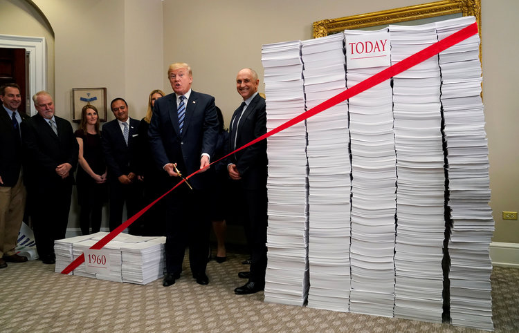
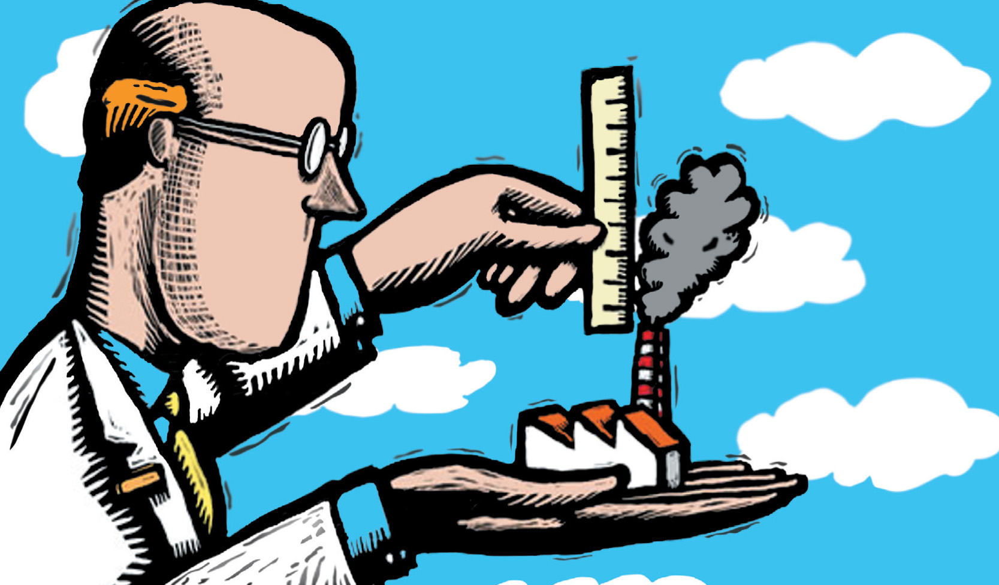
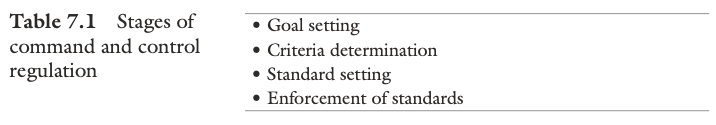
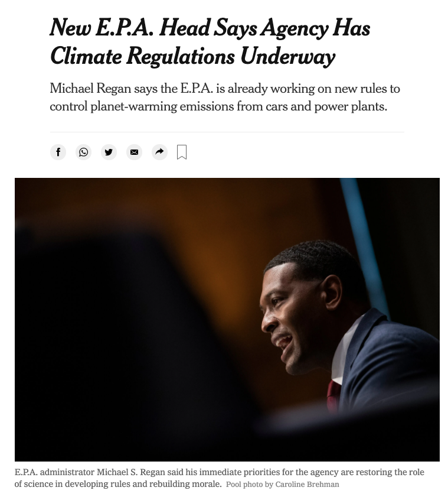

  
```{r setup, include=FALSE}
knitr::opts_chunk$set(warning = FALSE, message = FALSE, 
                      fig.retina = 3, fig.align = "center")
```

```{r xaringanExtra, echo=FALSE}
xaringanExtra::use_webcam()
```

# Environmental Regulations

.pull-left[
<figure>
  
</figure>

]

.pull-right[

**POLI 307: Environmental Policy**

**Spring 2021**

.light[Matthew Nowlin, PhD<br>
Department of Political Science<br>
College of Charleston
]

]


---

class: title title-2

# Topic Overview

.pull-left[
**Making Regulations** 
* Definitions 
* Rulemaking process

**Implementation** 
* Command-and-control regulations 
* Regulating greenhouse gases

]

.pull-right[
</br>
<figure>
  
</figure>
]

---

class: title title-2

# Environmental Regulations 

--

**A _form_ of environmental policy made by executive branch agencies** 
* Most consequential form of executive branch policymaking
* The _Take Care Clause_ 
* Delegation 

--

**Regulation**: Specific standards or instructions concerning what individuals, businesses, and other organizations can or cannot do

---

class: title title-2

# Environmental Regulations 

**Regulations are made through the _rulemaking_ process** 

--

**Rulemaking**: The agency process of _translating congressional legislation_ into specific, actionable rules (RP, 186)
* Rules must have statutory authority 

--

**Rulemaking authority** 
* Is delegated to the executive branch agencies 
* Why delegate? 

---

class: title title-2

# Environmental Regulations 

**Delegation and Oversight**

**Elected officials use various oversight and control mechanisms to manage the bureaucracy** 

--

**President** 
* Appointment of sympathetic agency heads
* Regulatory review prior to final rule enactment
* Executive orders
* Changes in budget authority
* Bureaucratic reorganization plans

---

class: title title-2

# Environmental Regulations 

**Delegation and Oversight**

**Elected officials use various oversight and control mechanisms to manage the bureaucracy** 

**Congress** 

.pull-left[
* Authorization of agency
* Legislative language restricting discretion
* Budgetary control
]

--

.pull-right[
* _Police patrol_ oversight: Active monitoring
* _Fire alarm_ oversight: React to complaints from citizens and/or interest groups
]

---

class: title title-2

# The Rulemaking Process 

**The Administrative Procedures Act (1945)** 

--

The APA established the procedures an agency must follow to promulgate binding rules and regulations

--

* The agency can only act within the limits set by statute 

---

class: title title-2

# The Rulemaking Process 

**The Administrative Procedures Act (1945)** 

The APA established the procedures an agency must follow to promulgate binding rules and regulations

* The agency must meet the following tests: 
  * Be reasonable (sufficient factual support in the record)
  * Not be arbitrary or capricious 
  * Not be an abuse of discretion 

---

class: title title-2

# The Rulemaking Process 

**The Administrative Procedures Act (1945)** 

The APA established the procedures an agency must follow to promulgate binding rules and regulations

* Involves various stages and requires opportunities for public involvement 

---

class: title title-2

# The Rulemaking Process 

**Types of rules and rulemaking** 

--

**Formal rule**: Formal hearings that resemble a courtroom proceeding  

--

**Informal rule** (_Notice and Comment_): A quasi-legislative process that requires a public comment period

--

**Negotiated rulemaking**: Agency officials organize and participate in negotiations with stakeholders to develop a rule

--

**Hybrid**: Combines formal and informal 

---

class: title title-2

# The Rulemaking Process 

Stage 1: Pre-Proposal $\rightarrow$ Stage 2: Notice and Comment $\rightarrow$ Stage 3: Rule Finalization

--

**Stage 1: Pre-Proposal** 
* Gather technical, scientific, and economic information regarding why a rule is necessary, as well as how a rule should be developed

--

* Benefit-cost analysis of significant rules 

---

class: title title-2

# The Rulemaking Process 

Stage 1: Pre-Proposal $\rightarrow$ Stage 2: Notice and Comment $\rightarrow$ Stage 3: Rule Finalization

**Stage 2: Notice and Comment** 
* Publish a Notice of Proposed Rulemaking (NPRM) in the _Federal Register_

--

* Comment period of 30 to 60 days 


--

* [Regulations.gov](https://www.regulations.gov/)

---

class: title title-2

# The Rulemaking Process 

Stage 1: Pre-Proposal $\rightarrow$ Stage 2: Notice and Comment $\rightarrow$ Stage 3: Rule Finalization

**Stage 3: Rule Finalization** 

* Final rule is published in the _Federal Register_ 

--

* Agencies prepare for litigation 

---

<figure>
<center>
  
</figure>

---

class: title title-2

# The Rulemaking Process 

.pull-left[
**The Administrative Presidency** 
* Office of Management and Budget (OMB)
  * Office of Information and Regulatory Affairs (OIRA)

**Significant regulations must be reviewed by OIRA before publication**
]

.pull-right[
<figure>
  
</figure>
]

---

class: title title-2

# The Rulemaking Process 

**Significant Regulations** 

--

* **Economically significant**
  * An annual effect on the economy of $100 million or more

--

* Conflict with another agency 

--

* Raise novel legal or policy issues 

---

class: title title-2

# EPA Significant Regulations
.pull-left[
```{r, echo=FALSE, message=FALSE}
library(ggplot2)
epaRules <- read.csv("/Users/nowlinmc/Dropbox/Projects/Data/EPArules.csv")

epaR <- ggplot(data=epaRules, aes(x=year)) +
  geom_line(aes(y=rules), size=2) +
  # ylim(0, 5) +
  theme_bw() + 
  xlab("Year") + ylab("Number of Rules")

epaR + ggtitle("Number of Significant Regualtions from the EPA: 1981-2020") +
     theme(plot.title = element_text(lineheight=.8, face="bold"))
```
]

.pull-right[
</br>
**Reagan**: 8

**HW Bush**: 25

**Clinton**: 73

**W Bush**: 29

**Obama**: 47

**Trump**: 13
]

---

class: title title-2

# Environmental Regulations 

**The Stages Model** 

.pull-left[
1. Problem identification and definition
2. Agenda setting
3. Policy formulation
4. Policy legitimation
5. **Policy implementation**
6. Policy evaluation
]

.pull-right[
<figure>
  
</figure>
]

---

class: title title-2

# Environmental Regulations 

**5. Policy Implementation** 

**Process by which policies enacted by government are put into effect by the relevant agencies** 

--

* Implementation often involves **delegation** 
 * Agencies must define "_swimmable_" waters 

--

* Implementation often involves **policy creation**
  * EPA makes a regulation under the authority of the Clean Air Act 
 
---

class: title title-2

# Environmental Regulations  

**Command-and-Control** 

.pull-left[
* Set performance or technology standards

* They tend to work 
  * Clean Air Act
  * Clean Water Act 

* Benefits $>$ Costs 
]

.pull-right[
<figure>
  
</figure>
]


---

class: title title-2

# Environmental Regulations 

<figure>
<center>
  
</figure>

--

**Goal Setting** 
* Congress often sets broad goals that a law is designed to achieve
  * CWA: "swimmable", "fishable", "navigable" waters

--

* Weighed against other social and economic considerations 

---

class: title title-2

# Environmental Regulations 

<figure>
<center>
  
</figure>

**Criteria determination** 

* What is "clear air?" What is "clean water?" 

--

* Requires extensive data collection and analysis

--

* **In the CAA and CWA public health was the only consideration** 


---

class: title title-2

# Environmental Regulations 

<figure>
<center>
  
</figure>

**Standard setting** 
* Reflects the standards that are needed for "clean air" and/or "clean water" 

--

* Determinations about the level of pollution that is acceptable for public and environmental health

--

* Performance or technology 

---

class: title title-2

# Environmental Regulations 

<figure>
<center>
  
</figure>

**Enforcement of standards** 
* Facilities are monitored and inspected 

---

class: title title-2

# Environmental Regulations 

**Assumptions of command-and-control regulations** 

--

* **Top-down**: Other stakeholders involved, but regulations come from government agencies 

--

* **Government knows best**: Has the information and expertise to make regulations 

--

* **One-size-fits-all**: Regulations are applied uniformly 

---

class: title title-2

# Environmental Regulations 

**Assumptions of command-and-control regulations**

* **Deterrence strategy**: Facilities must comply or face consequences and absent regulation, facilities would pollute 

--

* **Little incentive to improve**: Facilities will meet the requirement, but not do any more to reduce pollution 

---

class: title title-2

# Environmental Regulations 

**Command-and-control (federalism) in action** 

--

**Regulatory structure**: Rulemaking process occurs at the federal level, with implementation and enforcement delegated to the states 

--

_States collectively issue more than 90 percent of all environmental permits, complete more than 75 percent of all environmental enforcement actions, and rely on the federal government for less than 25 percent of their total funding on environmental and natural resource concerns_ 

---

class: title title-2

# Environmental Regulations 

**Challenges of implementing command-and-control regulations** 

--

**Politics and competing priorities**  
* Environmental policy is both highly technical and highly political
* Agencies are responsive to political control 

--

**Federalism** 
* Adds complexity and coordination problems 

---

class: title title-2

# Environmental Regulations 

**Challenges of implementing command-and-control regulations** 

**Resource constraints** 
* Agency capacity: budgets and personnel 
* Knowledge 

--

**Administrative structures and discretion**  
* Internal factors 
* Organizational friction 

---

class: title title-2

# Environmental Regulations 

**Challenges of implementing command-and-control regulations** 

**Regulatory capture** 

_Occurs when regulators become beholden to those they attempt to regulate_ 

--

* Revolving door 

--

* Information asymmetries: companies may know more about their products than the regulators   

--

* Influence of interest groups 

---

class: title title-2

# Environmental Regulations 

**Regulating greenhouse gases under the Clean Air Act** 

--

_Massachusetts v. EPA_ (2007)
* In a 5-4 decision the court ruled that the EPA can regulate vehicle emissions of GHGs if the EPA determines that GHGs "endanger public health or welfare"

--

**EPA Endangerment finding** (2009)

* _Greenhouse gas emissions endanger both the public health and public welfare of current and future generations_ 

---

class: title title-2

# Environmental Regulations 

**Regulating greenhouse gases under the Clean Air Act** 

**Clean Power Plan** (Obama Administration) 

--

* Set of _goal_ of GHG emission reductions of 32 percent below 2005 levels by 2030

--


* _Performance standard_: 
 * Set limit on amount of GHGs that states can emit
 * Allowed states to come up with how they could meet the standard
 * If states didn't develop a plan, than the EPA would 

---

class: title title-2

# Environmental Regulations 

**Regulating greenhouse gases under the Clean Air Act** 

**Clean Power Plan** (Obama Administration) 

* To develop standards EPA examined whether states could: 
  * Run coal plants more efficiently 
  * Replace coal with natural gas 
  * Increase renewable energy sources 

--

* **Supreme Court issued a stay in February 2016 and the CPP was never implemented** 


---

class: title title-2

# Environmental Regulations 

**Regulating greenhouse gases under the Clean Air Act** 

**Affordable Clean Energy Rule** (Trump Administration)

--

* Estimated to cut emissions by 0.7 to 1.5 percent of 2005 levels by 2030 

--

* No state-based requirement, only facility requirements

--

* Efficiency standard that meant coal plants could be used more  

---

class: title title-2

# Environmental Regulations 

**Regulating greenhouse gases under the Clean Air Act** 

**Affordable Clean Energy Rule** (Trump Administration)

* EPA's impact assessment: _the proposed rule is expected to increase emissions of carbon dioxide (CO2) and increase the level of emissions of certain pollutants in the atmosphere that adversely affect human health_

---

class: title title-2

# Environmental Regulations 

**Regulating greenhouse gases under the Clean Air Act** 

**Affordable Clean Energy Rule** (Trump Administration)

* **Vacated by the DC District court in January 2021** 

_Because promulgation of the ACE Rule and its embedded repeal of the Clean Power Plan rested critically on a mistaken reading of the Clean Air Act, we vacate the ACE Rule and remand to the [Environmental Protection] Agency_ 


---

class: title title-2

# Environmental Regulations 

**Regulating greenhouse gases under the Clean Air Act** 

.pull-left[
**What's next?** 

_Beyond the fenceline_? 

What will be acceptable to a more conservative Supreme Court? 
]

.pull-right[
<figure>
  
</figure>
]


