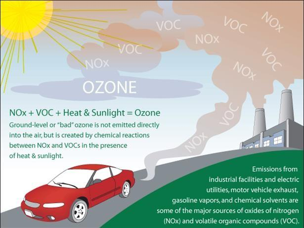

  
```{r setup, include=FALSE}
knitr::opts_chunk$set(warning = FALSE, message = FALSE, 
                      fig.retina = 3, fig.align = "center")
```

```{r xaringanExtra, echo=FALSE}
xaringanExtra::use_webcam()
```

# Pollution Control

.pull-left[
<figure>
  
</figure>

]

.pull-right[

**POLI 307: Environmental Policy**

**Spring 2021**

.light[Matthew Nowlin, PhD<br>
Department of Political Science<br>
College of Charleston
]

]


---

class: title title-2

# Topic Overview

.pull-left[
**Air Pollution** 

**Water Pollution**

**Toxic Chemicals**

**Waste Management**

**Implementation of Pollution Policies** 

]

.pull-right[
</br>
<figure>
<center>
  
</figure>
]

---

class: title title-2

# Air Pollution 

</br>
**Air pollution is a mix of particles and gases that can reach harmful concentrations both outside and indoors. Its effects can range from higher disease risks to rising temperatures. Soot, smoke, mold, pollen, methane, and carbon dioxide are a just few examples of common pollutants.** 

-- _National Geographic_ 


.small[_Watch short video on OAKS_]

---

class: title title-2

# The Clean Air Act 

--

**1963**: The Clean Air Act of 1963 
* Established program in the US Public Health Service 
* Funds for research into monitoring and control 

--

**1967**: Air Quality Control Act 
* Established _air quality control regions_ (AQCR)
* Left it to states to adopt and enforce pollution control in those regions

---

class: title title-2

# The Clean Air Act 

**1970** : Amendments 

--

* Directed EPA to set national ambient air quality standards (NAAQS)

--

* Permit for every new _point source_ 
  * New source performance standards 
  * Best available technology 

--

* Required automobile manufacturers to reduce pollution by 90%
  * _Technology forcing_: they had to invent it!   

---

class: title title-2

# The Clean Air Act 

**1970** : Amendments 

* Risk based standards for hazardous air pollutants 

--

* Federal grants for staffing state agencies

--

.pull-left[
**1977: Amendments** 
* Prevention of Significant Deterioration (PSD) in areas with high air quality ]

--

.pull-right[
**1990: Amendments** 
* Created cap-and-trade program for $\text{SO}_2$
]


---

class: title title-2

# The Clean Air Act 

**Overview** 

--

Defines **air pollutant** as _any physical, chemical, biological, radioactive substance or material which is emitted into or otherwise enters the ambient air_ 

---

class: title title-2

# The Clean Air Act 

**Overview** 

__Section 108__: requires EPA to identify air pollutants that may "reasonably be anticipated to __endanger__ public health or welfare" 
* From either _stationary_ or _mobile_ sources
* Termed _criteria pollutants_ 

--

<figure>
<center>
  
</figure>


---

class: title title-2

# The Clean Air Act 

**Overview** 

__Section 109__: requires EPA to adopt _National Ambient Air Quality Standards_ (NAAQS) for _criteria pollutants_ 
* _Primary_ standards: protect human health 
* _Secondary_ standards: includes animals, wildlife, water, and visibility 
* __Standards are uniform and based only on health considerations__ 

---

class: title title-2

# The Clean Air Act 

**Criteria Air Pollutants** 

--

__Carbon Monoxide__ CO
* A colorless, odorless gas that can be harmful when inhaled in large amounts, and is released when something is burned.
  * _Causes_: vehicles  
  * _Effects_: reduce level of oxygen in the blood supply 

---

class: title title-2

# The Clean Air Act 

**Criteria Air Pollutants** 

__Particulate Matter__ $\text{PM}_{10}$ and $\text{PM}_{2.5}$
* Mixture of solid particles and liquid droplets (dust, dirt, soot, smoke) 
  * _Causes_: construction sites, unpaved roads, smokestacks, fires  
  * _Effects_: respiratory problems, asthma 


---

class: title title-2

# The Clean Air Act 

**Criteria Air Pollutants** 

.pull-left[
__Ground Level Ozone__ $\text{O}_3$
* Created by chemical reactions between oxides of nitrogen (NOx) and volatile organic compounds (VOC)
  * _Effects_: chest pain, coughing, throat irritation, and airway inflammation
]

.pull-right[
<figure>
  
</figure>
]

---

class: title title-2

# The Clean Air Act 

**Criteria Air Pollutants** 

__Nitrogen Dioxide__ $\text{NO}_2$
* One of a group of highly reactive gases known as oxides of nitrogen or nitrogen oxides (NOx)
  * _Causes_: power plants and vehicles   
  * _Effects_: respiratory problems, asthma   

---

class: title title-2

# The Clean Air Act 

**Criteria Air Pollutants** 

__Sulfur Dioxide__ $\text{SO}_2$
* _Causes_: Burning of fossil fuels by power plants and other industrial facilities.   
* _Effects_: 
  * Harm the human respiratory system and make breathing difficult
  * Combines with nitrogen oxides $\text{NO}_x$ to form _acid rain_
  * Reacts with other compounds to form particulate matter

---

class: title title-2

# The Clean Air Act 

**Criteria Air Pollutants** 


__Lead__ Pb
* _Causes_: Industry and fuel    
* _Effects_: Adversely affect the nervous system, kidney function, immune system, reproductive and developmental systems and the cardiovascular system. Also affects the oxygen carrying capacity of the blood. May contribute to behavioral problems, learning deficits and lowered IQ in children  


---

class: title title-2

# Criteria Air Pollutants Standards 

<figure>
<center>
  
</figure>


---

class: title title-2

# Implementation of the Clean Air Act 

--

__Section 110__: requires states to develop and submit to EPA for approval _state implementation plans_ (SIPs) specifying measures to assure that air quality within each state meets the NAAQS 
* An example of _cooperative federalism_ 
* An example of a _performance standard_ 


---

class: title title-2

# Implementation of the Clean Air Act 

.pull-left[
**Attainment and non-attainment areas**
* States with _nonattainment_ areas must initiate new SIPs 
]

.pull-right[
<figure>
  
</figure>
]

---

class: title title-2

# Implementation of the Clean Air Act 

__Section 111__: requires EPA to establish nationally uniform standards for major new stationary sources of air pollution 
* _New Source Performance Standards_ (NSPSs)
* Technology-based, _best available control technologies_ (BACT) 

--

_New Source Review_
* Major new sources or major new modifications 
* Grandfather clause 

---

class: title title-2

# Air Pollution 

<figure>
<center>
  
</figure>
 

---

class: title title-2

# The Clean Air Act and Mobile Sources 

--

Three-pronged approach to auto pollution  
* National emission standards on new motor vehicles 
* Regulation of fuel content 
* Encouraged states to develop transportation control initiatives 

--

_The Energy Policy and Conservation Act_ (1975)
* Established _Corporate Average Fuel Economy_ (CAFE) standards for fuel efficiency 
  * Set by the _DOT_ and _EPA_ 


---

class: title title-2

# Water Pollution 

</br>
**Water pollution is the addition of harmful chemicals to natural water. Sources of water pollution in the United States include industrial waste, run-off from fields treated with chemical fertilizers, and run-off from areas that have been mined.** 

---

class: title title-2

# Water Pollution Sources 

.pull-left[
**Point sources**
* Indirect sources 
* Storm sewers

**Nonpoint sources**
* Agriculture 
]

.pull-right[
</br>
<figure>
<center>
  
</figure>
]


---

class: title title-2

# The Clean Water Act 

--

**1965**: Water Quality Act: _Required states to_ 
* Classify waterways according to intended use
* Set ambient water quality standards 
* Adopt implementation plans 
    
--

**1972**: Federal Water Pollution Control Act Amendments (_Clean Water Act_)
* Vetoed by President Nixon; veto overridden

---

class: title title-2

# The Clean Water Act 

**Overview** 

--

__Section 101__: _The objective of this Act is to restore and maintain the chemical, physical, and biological integrity of the Nation’s waters_

--

* All surface waters be _fishable and swimmable_ by 1983 

--

* _Zero pollution discharge_ by 1985 


--

**Required for all sources, not just _new_ sources** 

---

class: title title-2

# The Clean Water Act 

**Overview** 

__Section 301__: Prohibits _the discharge of any pollutant to **navigable** waters_ from a point source 

--

__Navigable waters__: _the **waters of the United States**, including the territorial seas_ (section 502(7))
* What constitute the _waters of the United States_? 

---

class: title title-2

# The Clean Water Act 

**Waters of the US** 

**_Rapanos v. United States_ 2006**
* Four-Justice plurality 
* Justice Kennedy concurring  

--

__Waters of the US Rule__ (2015): Clarified what is meant by _waters of the US_; extended protection to streams and wetlands; rescinded by Trump administration 

---

class: title title-2

# Implementation of the Clean Water Act 

**National Pollutant Discharge Elimination System (NPDES) permit** 
* Limits what can be discharged; requires monitoring and reporting 

--

__Publicly Owned Treatment Works (POTWs)__: Sewage plants
* _Technology_-based standards

--

__Industrial Point Sources__
* Effluent limitations

---

class: title title-2

# Toxic Chemicals 

--

**Risk-based Regulation** 
* **Risk-balancing**: balance between health risk and economic costs 

--

**Federal Environmental Pesticides Control Act (FEPCA) 1972**
* Pesticides regulated by the EPA 
* Only used for approved purposes

---

class: title title-2

# Toxic Chemicals 

**Safe Drinking Water Act 1974**
* Regulates the quality of water delivered by the water system to the consumer 
* Set health-based standards for “maximum contaminant levels” (MCLs)

--

**Toxic Substances Control Act 1976** 
* Testing and premanufacturing notification for new chemicals 
* Restrict use of chemicals that posed  "unreasonable risks"  

---

class: title title-2

# Waste Management 

--

**Resource Recovery Act 1970**
* Increased federal funding for waste recovery and recycling programs

--

**Resource Conservation and Recovery Act (RCRA) 1976**
* _Hazardous wastes_: highly flammable, reactive, corrosive, or toxic, or were specifically listed as hazardous by the EPA

---

class: title title-2

# Waste Management 

**Comprehensive Environmental Response, Compensation, and Liability Act (CERCLA) 1980** 
* Clean-up of past sites
* _National Priority List_ 
* _Joint and several liability_: anyone who used the site could be liable 
* Established a $1.6 billion federal trust fund for clean-up 
  * The _Superfund Act_ 
  
---

class: title title-2

# Implementation 

--

**Citizen Lawsuits** 
* Environmental movement shifted from a mass movement to an interest-group movement 
* Increased participation of the public in decision-making 

--

**Information Disclosures** 
* Compliance reporting
* **Toxics Release Inventory** 

---

class: title title-2

# Implementation 

**Risk Management** 

_The fundamental mission of the Environmental Protection Agency is to reduce risks_ 

--

**Risk Assessment** 
* Hazard identification
* Dose-response assessment
* Exposure assessment
* Risk characterization


---

class: title title-2

# Implementation 

**Flexibility** 

.pull-left[
**Market-based approaches** 
* Cap-and-trade 
* Bubbling, netting, and offsets

**vs Best Available Technology** 
]

.pull-right[
<figure>
<center>
  
</figure>
]


