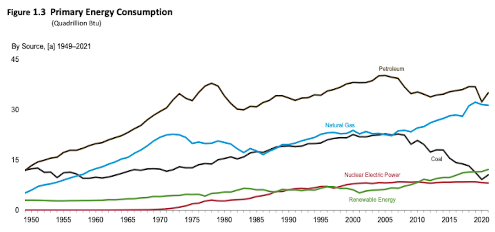
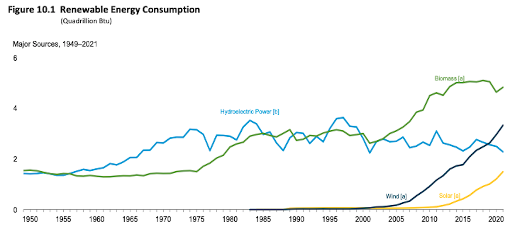

  
```{r setup, include=FALSE}
knitr::opts_chunk$set(warning = FALSE, message = FALSE, 
                      fig.retina = 3, fig.align = "center")
```

# Energy and Climate Change

.pull-left[
<figure>
  
</figure>

]

.pull-right[

**POLI 307: Environmental Policy**

**Spring 2022**

.light[Matthew Nowlin, PhD<br>
Department of Political Science<br>
College of Charleston
]

]


---

class: title title-2

# Topic Overview

.pull-left[
**Quick Climate Science Overview** 
* It's happening, it's us, it's bad 

**Energy**
* Sources 
* Policy 

]

.pull-right[
</br>
<figure>
<center>
  
</figure>
]

---

class: title title-2

# Environmental Impacts 

_**No sector of human activity impacts the environment more pervasively than the production and use of energy**: coal and uranium mining, oil and gas extraction, rivers dammed for hydroelectric power, air pollution and global warming from fossil fuel combustion, risks of nuclear waste management, and others_

--

**Fossil Fuels** 

.pull-left[
* Air pollution 
* Hazardous wastes 
* Land disturbances
]

.pull-right[
* Ecosystem impacts 
* Oil spills 
* **Climate change**
]


---

<iframe src="https://embed.polleverywhere.com/multiple_choice_polls/OKFdwv4CstC31otUDwXG1?controls=none&short_poll=true" width="800px" height="600px"></iframe>

---

class: title title-2

# Environmental Impacts 

**Climate change**

_A long-term change in the average weather patterns that have come to define Earth’s local, regional, and global climates. These changes have a broad range of observed effects that are synonymous with the term_ 

--

* "Long-term" = 30 years 
* Climate vs. weather 
* Climate change vs. global warming

---

<figure>
  
</figure>

---

background-image: url(https://media.giphy.com/media/1lwtquKquRLGwFAQVU/giphy.gif)
background-position: 50% 50%
background-size: 80%
class: center, bottom, fullscale

---

class: title title-2

# Climate Science 

.pull-left[
**It's Happening**

_The planet's average surface temperature has risen about 1.18 degrees Celsius  (2.12 degrees Fahrenheit) since the late 19th century_ 

-NASA
]

.pull-right[
</br>
<figure>
<center>
  
</figure>
]

---

class: title title-2

# Climate Science 

.pull-left[
**It's Us** 

_Anthropogenic forcing_

* Human factors associated with 100%+ of observed warming 

* Increases of $\text{CO}_2$ since the industrial revolution  


]

.pull-right[
<figure>
<center>
  
  
</figure>
]


---

class: title title-2

# Climate Science 

## It Has Serious Consequences 

.pull-left[
**Increasing Temperatures** 
* 19 of the 20 warmest years have all occurred since 2001
* 2016 and 2020 warmest years on record
]

--

.pull-right[
**Precipitation Patterns** 

* Average US precipitation has increased since 1900
* A warmer atmosphere can hold more water vapor 
* Increased drought
]

---

class: title title-2

# Climate Science 

## It Has Serious Consequences 

.pull-left[
**Hurricanes** 
* Stronger and more intense 
* Hurricane Harvey (2017) and Hurricane Florence (2018) rainfall  
]

--

.pull-right[
**Sea Level Rise** 
* Projected to be 1 to 4 feet by 2100

**Environmental Justice** 
* Disproportionate impacts 
]

---

class: title title-2

# US Greenhouse Gas Emissions 

<figure>
<center>
  
</figure>

---

class: title title-2

# Course Evaluations 

<figure>
<center>
  
</figure>

---

class: title title-2

# Energy Production

<figure>
<center>
  
</figure>


---

class: title title-2

# Energy Consumption

<figure>
<center>
  
</figure>


---

class: title title-2

# Fossil Fuel Formation 

<figure>
<center>
  
</figure>

---

class: title title-2

# Fossil Fuel Formation 

<figure>
<center>
  
</figure>


---

<iframe src="https://embed.polleverywhere.com/multiple_choice_polls/R2GaMiLyoOl3w2TV83CLG?controls=none&short_poll=true" width="800px" height="600px"></iframe>

---

class: title title-2

# Electric Power Grid 

.pull-left[
**Federal Energy Regulatory Commission (FERC)** 

**North American Electric Reliability Corporation (NERC)** 
]

.pull-right[
<figure>
  
</figure>
]


---

class: title title-2

# Oil and Petroleum 


.pull-left[
__Crude oil__: a mixture of hydrocarbons that formed from plants and animals that lived millions of years ago

__Petroleum products__: are fuels made from crude oil and other hydrocarbons contained in natural gas
]

.pull-right[
<figure>
  
</figure>
]

---

class: title title-2

# Natural Gas 

.pull-left[
Natural gas is a fossil energy source that formed deep beneath the earth's surface. Natural gas contains many different compounds. The largest component of natural gas is **methane**, a compound with one carbon atom and four hydrogen atoms (CH4)
]

.pull-right[
</br>
<figure>
  
</figure>
]

---

class: title title-2

# Hydrologic Fracturing 

_Involves pumping liquids under high pressure into a well to fracture the rock and allow gas to escape from tiny pockets in the rock_ 

--

**The Fracking Revolution** 
* Used for natural gas beginning in 2005 
* Displacing coal and nuclear 
* Comes largely from private land 

---

class: title title-2

# Coal 

.pull-left[
Coal is a combustible black or brownish-black sedimentary rock with a high amount of carbon and hydrocarbons. Coal is classified as a nonrenewable energy source because it takes millions of years to form
]

.pull-right[
<figure>
  
</figure>
]

---

class: title title-2

# Coal 

**A "War on Coal"?** 

--

.pull-left[
**Production, Consumption, and Exports**
<figure>
  
</figure>
]

--

.pull-right[
**Coal Jobs** 
</br>
</br>
<figure>
  
</figure>
]

---

class: title title-2

# Nuclear Energy 

.pull-left[
Nuclear power comes from __nuclear fission__ 
* In nuclear fission, atoms are split apart to form smaller atoms, releasing energy

* __Uranium__ (U-235)
]

.pull-right[
<figure>
  
</figure>
]


---


class: title title-2

# Nuclear Energy 

**Stalled Hope?** 

.pull-left[
_Too cheap to meter_ 
* Environmental concerns 
* Safety concerns 
* Nuclear waste
]

.pull-right[
<figure>
<center>
  
</figure>
]

---

class: title title-2

# Renewable Energy 

.pull-left[
Renewable energy is energy from sources that are naturally replenishing but flow-limited. They are virtually inexhaustible in duration but limited in the amount of energy that is available per unit of time  
]

.pull-right[
<br>
<figure>
  
</figure>
]

---

class: title title-2

# Energy Policy 

--

**1970's: Energy Crisis**

* OAPEC Oil Embargo 1973 

--

* Department of Energy 1977 (formerly _Energy Research and Development Administration 1974_)

--

* _National Energy Act 1978_ 

--

* **Iranian Revolution and Iran-Iraq War** 

--

* _Hard path_ vs _soft path_ 

---

class: title title-2

# Energy Policy 

**The Reform Era and Beyond** 

--

**Fossil fuels and free markets**
* Fossil fuels are cheap 

--

**Increasing renewables** 
* _American Recovery and Reinvestment Act 2009_ 
* Renewable Portfolio Standards in states

--

**Green New Deal?** 

---

<iframe src="https://embed.polleverywhere.com/multiple_choice_polls/BD09LlHVxIUMWrEgPqOOL?controls=none&short_poll=true" width="800px" height="600px"></iframe>


