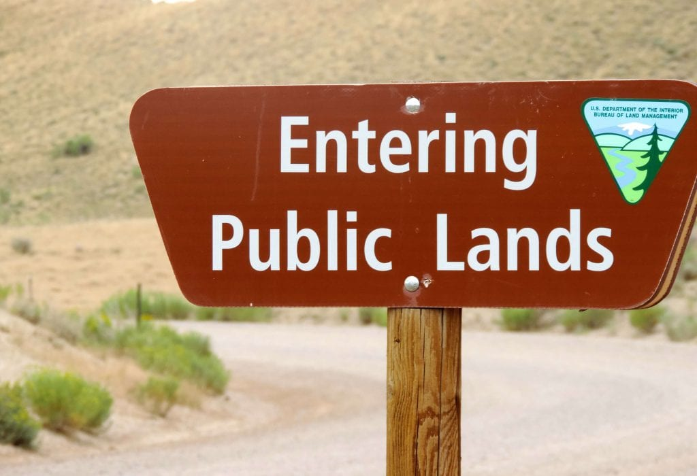
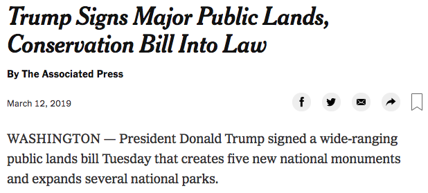
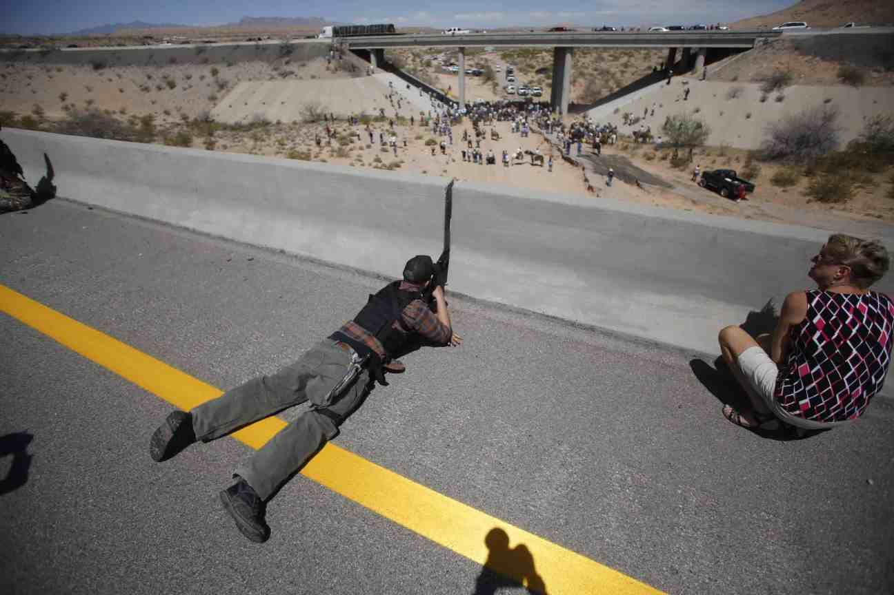
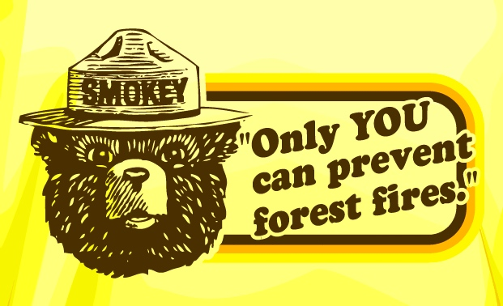
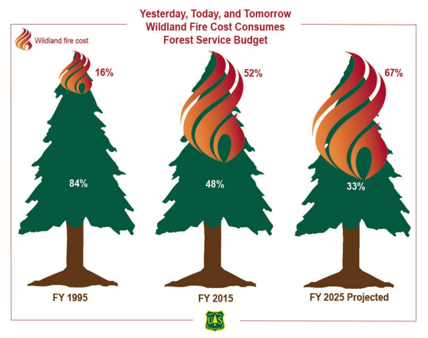
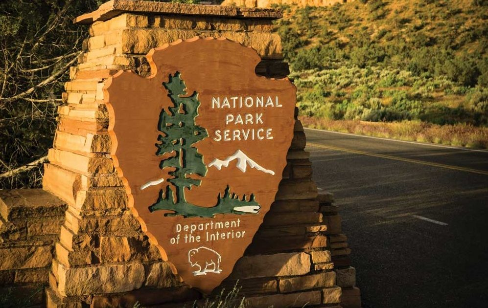
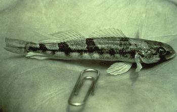
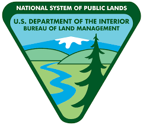
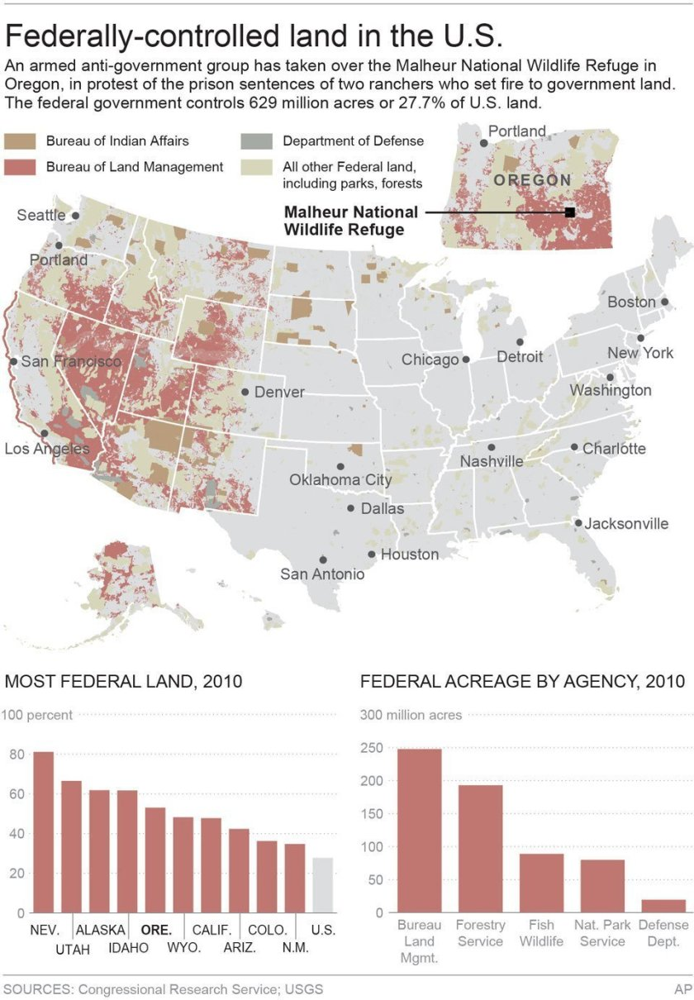
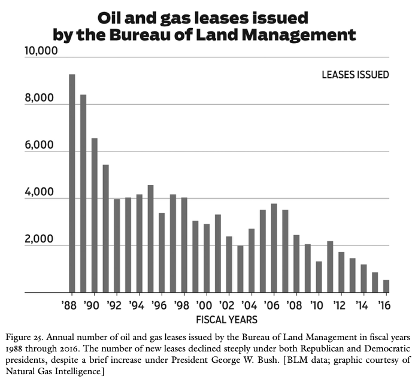

  
```{r setup, include=FALSE}
knitr::opts_chunk$set(warning = FALSE, message = FALSE, 
                      fig.retina = 3, fig.align = "center")
```

```{r xaringanExtra, echo=FALSE}
xaringanExtra::use_webcam()
```

# Public Lands

.pull-left[
<figure>
  
</figure>

]

.pull-right[

**POLI 307: Environmental Policy**

**Spring 2021**

.light[Matthew Nowlin, PhD<br>
Department of Political Science<br>
College of Charleston
]

]


---

class: title title-2

# Topic Overview

.pull-left[
**Public Lands** 
* Definition
* Controversies 
* Historical development
* Management of public lands 

]

.pull-right[
</br>
<figure>
<center>
  
</figure>
]

---

class: title title-2

# Public Lands 

**What are public lands?** 

.pull-left[
Owned and administered by national, state, and local governments

_Federal government owns about 28% of surface land_  

**Common-pool** and **public good**
]


.pull-right[
<figure>
  
</figure>
]

---

class: title title-2

# Public Lands 

**Ecosystem Services** 

--

_Benefits people obtain from ecosystems_ 

--

* **Provisioning Services**: food, freshwater, other goods 

--

* **Regulating Services**: climate, pollination, store carbon, flooding 

--

* **Supporting Services**: soil formation, nutrient cycling

--

* **Cultural Services**: educational, aesthetic, recreation 

--

**Benefits can be measured by _willingness-to-pay_** 

---

class: title title-2

# Public Lands 

**Controversies** 

--

* _Preservation_ vs _conservation_ 

--

* _Market commodities_ vs _spiritual and aesthetic values_; _ecosystem services_

--

* Conflicting economic uses 
  * _Extraction_ vs _tourism_ 

--

* Conflicting management philosophies
  * _Open-access_ vs _rule-based_


---

class: title title-2

# Public Lands 

**The Constitution**  

--

__The Property Clause__: Article IV, Section 3, Clause 2  

> The Congress shall have Power to dispose of and make all needful Rules and Regulations respecting the Territory or other Property belonging to the United States 

---

class: title title-2

# Public Lands 

**The Constitution**  

__The Takings Clause__: Fifth Amendment 

> nor shall private property be taken for public use, without just compensation 
--


_Regulatory takings_  
* _Lucas v. South Carolina Coastal Council_ (1992)
* _all economically beneficial use of land_


---

class: title title-2

# Public Lands 

**Environmental Policy Eras**

--

__Development Era: 1800-1890__ 
* _Federal land policy was to transfer ownership to the states and private entities_ 

--

**Homestead Act 1862** 
* Any adult (21) citizen or intended citizen that had not borne arms against the US government could claim 160 acres to settle and cultivate for 5 years

---

class: title title-2

# Public Lands 

**Environmental Policy Eras**


__Development Era: 1800-1890__ 
* _Federal land policy was to transfer ownership to the states and private entities_ 

**General Mining Act 1872** 
* Title to extract _valuable deposits_ (gold, silver, copper) to whoever found and staked a claim 

---

class: title title-2

# Public Lands 

**US Territory** 

--

Louisiana Purchase (1803)

--

Treaty with Spain (1819): _Florida_  

--

Annexation of Texas (1845)

--

Oregon Treaty (1846): _Washington, Oregon, Idaho, and portions of western Montana_ 

---

class: title title-2

# Public Lands 

**US Territory** 

.pull-left[
End of the Mexican-American War (1848): _California, Nevada, Utah, Arizona, and New Mexico_   

Gadsden Purchase (1853): _Parts of southern Arizona and south-west New Mexico_ 
]

.pull-right[
<figure>
  
</figure>
]

---

class: title title-2

# Public Lands 

**Environmental Policy Eras**

__Conservation Era: 1891-1961__

* Limit excesses and encourage both businesses and individuals to use the nation's vast natural resources more carefully through government regulation

--

_Conservation means the wise use of the earth and its resources for the lasting good of men_

-- Gifford Pinchot

---

class: title title-2

# Public Lands 

**Environmental Policy Eras**

__Conservation Era: 1891-1961__

**The Antiquities Act 1906** 
* Gave the president power to create national monuments from federal land 

--

* Protection of _historic landmarks, historic and prehistoric structures, and other objects of historic or scientific interest_ 

--

* **129 national monuments** 

---

class: title title-2

# Public Lands 

**Environmental Policy Eras**

**Environmentalism Era: 1962-1980** 

* _National forest and other public land management decisions now required formal planning procedures, including documentation of environmental impacts and alternatives, interagency review, public input, and expanded rights for legal challenges and judicial review_ (Andrews, pg 276)

---

class: title title-2

# Public Lands 

**Environmental Policy Eras**

**Environmentalism Era: 1962-1980** 

**The Land and Water Conservation Fund 1964**
* Authorized funding for federal and state land acquisition for parks, outdoor recreation, and other conservation purposes

--

* Based on fees, but appropriated by Congress 

--

* Expired in 2015 

---

class: title title-2

# Public Lands 

**The Land and Water Conservation Fund 1964**

**John D. Dingell Jr. Conservation, Management, and Recreation Act 2019**

.pull-left[
* Provides 1.3 million acres of new wilderness 

* Land and Water Conservation Fund made permanent 
]

.pull-right[
<figure>
  
</figure>
]


---

class: title title-2

# Public Lands 

**Environmental Policy Eras**

**Environmentalism Era: 1962-1980** 

**The Wilderness Act 1964** 
* _Preserve_ some of last remaining large areas of wild public land

--

* **Eastern Wilderness Act 1974** 
  * Lands in the east that had recovered to their mostly nature state 

---

class: title title-2

# Public Lands 

**Environmental Policy Eras**

**The Endangered Species Act 1966 / 1973** 

.pull-left[
List endangered or threatened species of plants and animals

Prevents _taking_ of species or destruction of their _critical habitat_ 


]

.pull-right[
<figure>
  
</figure>
]

---

class: title title-2

# Public Lands 

**Environmental Policy Eras**

**Reform Era: 1980-2000**  

**Sagebrush Rebellion** 

--

.pull-left[
* Ranchers 
* Mining companies 
* Western state governments 
* Property _inholders_ in and around national parks
]

.pull-right[
<figure>
  
</figure>
]

---

class: title title-2

# Public Lands 

**Environmental Policy Eras**

**Reform Era: 1980-2000**  

**Wise-Use Movement** 

--

.pull-left[
Grazing fees on public lands
* Antigovernment ideology 
* _Cliven Bundy and his sons_    
]

.pull-right[
<figure>

</figure> 
]

---

class: title title-2

# Public Lands 

<figure>
<center>
  
</figure>

---

class: title title-2

# Forest Service 

**Department of Agriculture**

.pull-left[
__Mission__: _Sustain the health, diversity, and productivity of the nation’s forests and grasslands to meet the needs of present and future generations_ 
]

.pull-right[
<figure>
  
</figure>
]

---

class: title title-2

# Forest Service 

**Department of Agriculture**

**Manages** 
* 193 million acres across 43 states 
* 154 national forests and 20 grasslands 

--

**National Forest Management Act 1976** 
* Develop comprehensive plans for the management of national forests
    

---

class: title title-2

# Forest Service 

**Multiple-Use Management** 
* Major focus on timber and logging 

--

**Ecosystem Management**
* "Adaptive management" and ecological sustainability 
* Obama Administration rule (2012)
  * Forest restoration 
  * Adaptation to climate change
  * Strengthened public input

---

class: title title-2

# Forest Service 

**Fire Management**

.pull-left[
* Longer fire seasons
* Bigger fires: more acres burned 
* Exacerbated by climate change 
* _Prescribed fire_ 
]

.pull-right[
<figure>
  
</figure>
]

---

class: title title-2

# National Park Service 

**Department of the Interior** 


.pull-left[
__Mission__: _Preserves unimpaired the natural and cultural resources and values of the National Park System for the enjoyment, education, and inspiration of this and future generations_ 
]

.pull-right[
<figure>
  
</figure>
]

---

class: title title-2

# National Park Service 

**Manages**
* 400 sites 
* 59 national parks 
* 89 national monuments 
* Historic sites (Fort Sumter)

--

**Preservation vs Mass Recreation** 
* 15 percent of funding comes from fees, franchises, donations, and other sources 

---

class: title title-2

# Fish and Wildlife Service

**Department of the Interior** 

.pull-left[
__Mission__: _Work with others to conserve, protect and enhance fish, wildlife and plants and their habitats for the continuing benefit of the American people_ 
]

.pull-right[
<figure>
  
</figure>
]

---

class: title title-2

# Fish and Wildlife Service

**Endangered Species** 

--

* Identifies and lists endangered or threatened species
  * 1600 US species, and 600 foreign species

--

* **National Wildlife Refuge System**
  * 560 refuges, 38 wetland management districts 
  * 150 millions acres of land and water 

---

class: title title-2

# Fish and Wildlife Service

**Endangered Species** 

* Imposes federal restrictions on public and private lands without compensation


--

.pull-left[
_Charismatic megafauna_
]


.pull-right[
<center>
<figure>
  
</figure>
.tiny[_Snail Darter_]
]

---

class: title title-2

# Bureau of Land Management 

**Department of the Interior** 

.pull-left[
__Mission__: _To sustain the health, diversity, and productivity of the public lands for the use and enjoyment of present and future generations_ 
]

.pull-right[
<figure>
<center>
  
</figure>
]

---

class: title title-2

# Bureau of Land Management 

.pull-left[
**Created in 1946 by combining**:
* General Land Office (1812)
* Grazing Service (Taylor Grazing Act 1934)

**Manages**
* 256 million acres
* 99.9 percent in 12 Western states, including Alaska 
]

.pull-right[
<figure>
  
</figure>
]

---

class: title title-2

# Bureau of Land Management 

**Federal Land Policy and Management Act 1976**
* National System of Public Lands 
* Comprehensive long-range planning 
* Grazing fees 

--

Stakeholders 
  .pull-left[
* Ranchers 
* Mining interests 
* Native American tribes
  ]
  
  * Environmentalists 
  * Outdoor recreation  

---

class: title title-2

# Bureau of Land Management 

**Coal, Oil, and Gas Leasing** 

.pull-left[
**Mineral Leasing Act 1920** 

**Surface Mining Control and Reclamation Act 1977**

_Arctic National Wildlife Refuge_ 

(Small) fossil fuel subsidy 

]

.pull-right[
<figure>
  
</figure>
]

---

class: title title-2

# Ocean Conservation 

_Manages the areas of the ocean under US jurisdiction, and their fisheries, minerals, ecosystems, and other resources_ 

--

**National Oceanic and Atmospheric Administration (NOAA)** 
* Created in 1970
* Combined the Bureau of Commercial Fisheries, the Weather Bureau, and the US Coast and Geodetic Survey 
* _the principal agency for scientific monitoring of atmospheric and ocean conditions and for management of US ocean fisheries_ 

---

class: title title-2

# Ocean Conservation 

**Fisheries Conservation and Management Act 1976** 
* The _Magnuson-Stevens Act_ 
* Sustainable management of commercial fisheries

--

**Sustainable Fisheries Act 1996** 
* Required management plans include criteria to limit overfishing 
* **2007**: _catch share programs_ including individual fishing quotas and limited-access privileges

---

class: title title-2

# Ocean Conservation 

**The National Marine Sanctuaries Act 1972** 
* Designate and manage marine areas of importance 
* _Marine Protected Areas_, ~1000

--

**Coastal Zone Management Act 1972** 
* Promote active planning and management of coastal areas 

--

**Restrict activities that directly impact the living resources of the ocean** 


